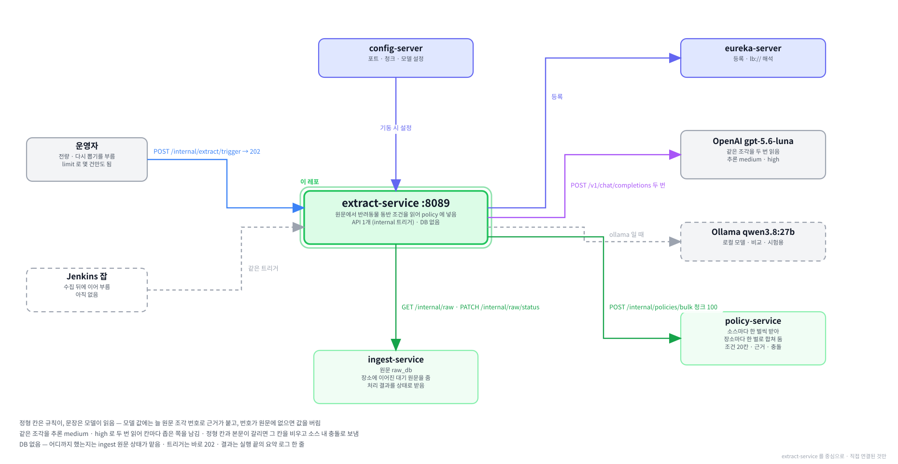

# extract-service

**함께하개**는 반려동물과 함께 갈 수 있는 장소를 찾고, 우리 아이가 그곳에
들어갈 수 있는지 판정해 주는 서비스입니다.

이 저장소는 그중 **수집한 안내문에서 반려동물 동반 조건을 읽어 내는 서버**입니다.
관광 기관 3곳이 제각각 적은 안내문을 조건 20칸과 근거 문장으로 바꿔 조건 서비스(policy)에 넣습니다.

---

**먼저 전체 그림을 보고, 이 레포가 그 안 어디에 있는지 본 뒤 읽습니다.**

**① 전체 구조 — 층으로 본 것.** 위에서 아래로 요청이 내려가고, 어느 층에 무엇이 있는지.


**② 전체 구조 — 서비스끼리 무엇을 주고받는지.** 초록 실선이 `/internal` 호출, Kafka 표가 이벤트, 하늘색 점선이 VPC 경계.


**③ 이 레포를 중심으로.** 직접 연결된 것만 남긴 그림.



<br><br>

---

## 본문 시작

<br><br>

---

## 0. 이 서비스가 하는 일

### 0-1. 한 문장

> 원문 수집 서비스(ingest)가 모아 둔 안내문을 읽어, 장소마다 "반려견과 함께 들어갈 수 있는가, 어떤 조건으로"
> 를 조건 20칸과 근거 문장으로 만들고 조건 서비스(policy)에 넣습니다.

예를 들어 한국관광공사가 가야산생태탐방원을 이렇게 적어 두었습니다.

```
[동반 유형] 일부구역 동반가능
[동반 가능 반려동물] 최근 1년이내 광견병 접종(증빙서류 필요) 을 완료한 등록된 반려견만 입장 가능(단, 맹견은 입장제한 )
[기타 동반 안내] 가야산생태탐방원 2동 (자연의집 - 반려견 전용실)에서만 동반 가능
```

이 서비스는 이것을 아래처럼 바꿉니다. 칸마다 원문의 어느 문장에서 읽었는지가 함께 붙습니다.

| 칸 | 값 | 근거 문장 |
|---|---|---|
| 동반 범위 | 일부 구역 | `일부구역 동반가능` · `2동 (자연의집 - 반려견 전용실)에서만 동반 가능` |
| 동반 가능 구역 | 가야산생태탐방원 2동 (자연의집 - 반려견 전용실) | `…에서만 동반 가능` |
| 견종 제한 | 맹견 불가 | `(단, 맹견은 입장제한 )` |
| 접종 증명 | 필요 | `광견병 접종(증빙서류 필요)` |
| 나머지 16칸 | 비어 있음 (정보 없음) | — |

판정 서비스(verdict)는 이 20칸을 반려견의 체중 · 견종과 대조해 "가능 · 확인 필요 · 불가" 를 냅니다.

---

### 0-2. 다른 서비스와의 자리

```
                              사람 · Jenkins
                              │  POST /internal/extract/trigger
                              ▼
ingest-service ──대기 원문──▶ extract-service ──조건 · 근거──▶ policy-service ──▶ verdict-service
raw_db         ◀──처리 결과── 규칙 · OpenAI                    policy_db          (아직 없음)
```

| 상대 | 이 서비스가 하는 일 | 경로 |
|---|---|---|
| ingest-service | 장소에 이어진 대기 원문을 100건씩 가져옴 | `GET /internal/raw?status=PENDING&size=100` |
| ingest-service | 처리한 원문을 완료 · 실패로 되돌려 씀 | `PATCH /internal/raw/status` |
| policy-service | 뽑은 조건 · 근거 · 충돌을 100건씩 넣음 | `POST /internal/policies/bulk` |
| OpenAI | 안내문 문장을 읽힘 | `POST /v1/chat/completions` |
| 사람 · Jenkins | 이 서비스를 부름 | `POST /internal/extract/trigger` |

**이 서비스는 화면과 직접 이야기하지 않습니다.** 경로가 전부 `/internal` 이라 게이트웨이가 라우팅하지 않고,
받는 요청은 실행을 시작하라는 트리거 하나뿐입니다. 뽑은 결과는 policy 에 저장되고, 화면은 policy 와
판정 서비스를 거쳐 그 결과를 봅니다.

**이벤트를 내지도 받지도 않습니다.** 조건이 바뀌었다는 알림(`policy.changed`)은 policy 가 저장하면서 냅니다.

---

### 0-3. 무엇이 들어 있나

| 들어 있는 것 | 하는 일 | 자세히 |
|---|---|---|
| 규칙 추출 | 정형 칸(예: 고캠핑 `animalCmgCl` = "가능(소형견)")을 정해진 규칙으로 읽음 | [3장](#3-규칙이-읽는-것) |
| 모델 추출 | 안내문 문장을 OpenAI 모델에게 읽히고, 모델이 짚은 문장이 원문에 있는지 검사함 | [4장](#4-모델이-읽는-것) |
| 합치기 | 규칙과 모델이 읽은 것 · 모델의 두 읽기 · 한 장소의 원문 여럿을 한 벌로 | [5장](#5-합치기) |
| 실행 루프 | 대기 원문을 100건씩 끝까지 돌고 멈출 자리에서 멈춤 | [6장](#6-실행-한-번) |
| 정확도 평가 | 사람이 정답을 적어 둔 표본으로 모델이 얼마나 맞는지 잼 | [7장](#7-얼마나-맞나) |

없는 것도 적어 둡니다. 처음 보는 사람이 가장 많이 찾는 것들입니다.

| 없는 것 | 까닭 |
|---|---|
| DB | 어디까지 처리했는지는 ingest 의 원문 상태가 맡고, 뽑은 결과는 policy 에 저장됩니다. 이 서비스는 들고 있는 데이터가 없습니다 |
| Kafka · Redis | 이벤트를 내지 않고, 캐시할 것도 없습니다 |
| 화면이 부르는 API | 위 0-2 대로 부르는 쪽은 사람과 Jenkins 뿐입니다 |

---

### 0-4. 6가지만 기억하면 됩니다

**① 이 서비스에는 DB 가 없습니다.** 어디까지 했는지는 ingest 의 원문 상태(`PENDING` · `DONE` · `FAILED`)가 맡습니다.
멈췄다가 다시 부르면 대기(`PENDING`)로 남은 원문부터 이어서 돕니다.

**② 정형 칸은 규칙이, 문장은 모델이 읽습니다.** "가능(소형견)" 같은 짧은 정형 값은 규칙으로 읽는 것이 늘 같고 공짜입니다.
"주말 및 공휴일은 13kg 이하" 같은 문장만 모델에게 넘깁니다.

**③ 모델이 채운 값에는 늘 원문 문장이 근거로 붙습니다.** 모델은 번호 붙은 원문 조각 중 몇 번에서 읽었는지만 답하고,
문장을 직접 쓰지 않습니다. 짚은 번호가 원문에 없으면 그 값을 버립니다. 그래서 화면에 뜨는 근거는 원문에 없는 말일 수 없습니다.

**④ 같은 원문을 두 번 읽고, 허용을 넓히는 값은 둘이 같이 말할 때만 씁니다.** 한 번은 보통 추론으로, 한 번은 깊은 추론으로 읽어
칸마다 좁은 쪽을 남깁니다. "허용을 넓히는 틀림" 이 사용자가 가서 거절당하는 틀림이기 때문입니다.

**⑤ 정형 칸과 본문이 서로 다르게 말하면 그 칸을 비웁니다.** 어느 쪽이 맞는지 고르지 않고, 그 칸을 비운 채 "소스 내 충돌" 로 남깁니다.
판정은 "확인 필요" 로 떨어지고 화면에는 충돌 배지가 붙어, 사용자가 원문을 직접 보게 됩니다.

**⑥ 트리거는 바로 202 로 답하고, 결과는 실행 끝의 요약 로그 한 줄에 남습니다.** 전량은 2시간 안팎 걸리므로 응답을 기다리지 않습니다.
이미 돌고 있을 때 다시 부르면 409 입니다.

---

### 0-5. 화면에서 어디에 쓰이나

이 서비스가 뽑은 것은 판정 서비스를 거쳐 화면에 나옵니다. 판정 서비스는 아직 없으며, 아래는 그것이 생기면 쓰일 자리입니다.

| 화면 | 쓰이는 것 |
|---|---|
| 검색 · 장소 카드의 판정 배지 | 조건 20칸 — 반려견의 체중 · 견종과 대조해 "가능 · 확인 필요 · 불가" |
| 장소 상세의 판정 이유 | 칸마다 어디서 왔는지 — 공공데이터 항목 · 안내문을 AI 가 읽음 · 관리자 확인 |
| 판정 이유 옆의 근거 | 근거 문장 · [원문 보기] |
| 장소 상세의 조건 충돌 배지 | 소스 내 충돌 — 한 기관의 안내문 안에서 정형 칸과 본문이 다르게 말한 자리 |

⚠**AI 가 읽은 조건은 100% 맞지 않습니다.** 정답을 적어 둔 새 원문 40건에서 재 보면 정밀도 93% · 재현율 94% 안팎입니다([7장](#7-얼마나-맞나)).
그래서 판정은 필요한 칸이 하나라도 비면 "가능" 대신 "확인 필요" 를 내고, 화면은 AI 가 읽은 줄에 그 사실과 근거를 함께 보여 줍니다.

<br><br>

---

## 1. 로컬에서 띄우기

### 1-1. 전체 흐름

| 순서 | 할 일 | 확인 |
|---|---|---|
| ① | 인프라 컨테이너 — postgres · config-server · eureka-server | `docker compose ps` 에 `healthy` |
| ② | 이어지는 두 서비스 — ingest · policy | 둘 다 `/actuator/health` 가 `UP` |
| ③ | OpenAI 키 준비 | 키 길이가 0 이 아님 |
| ④ | 이 서비스 실행 | `Started ExtractApplication` |
| ⑤ | 떴는지 확인 | 상태 확인 · 유레카 등록 |
| ⑥ | 20건만 불러 보기 | policy 에 20곳이 들어감 |

---

### 1-2. ① 인프라 컨테이너

infra 레포에서 띄웁니다. 이 서비스는 DB 를 쓰지 않지만, 이어지는 ingest · policy 가 postgres 를 씁니다.

```bash
cd ../infra
docker compose up -d
docker compose ps
```

Windows 와 macOS 가 같습니다. `.env` 의 `COMPOSE_PROFILES` 에 `infra` · `platform` · `db` 가 들어 있어야
postgres · config-server · eureka-server 가 뜹니다. 프로파일의 뜻은 infra README 에 있습니다.

---

### 1-3. ② 이어지는 두 서비스

ingest 와 policy 를 *이 서비스와 같은 방식으로* 띄웁니다. 이 서비스를 IntelliJ 로 띄우면 두 서비스도 IntelliJ 로,
컨테이너로 띄우면 두 서비스도 컨테이너로 띄웁니다.

⛔**섞으면 서로 못 찾습니다.** 이 서비스는 두 서비스의 주소를 유레카에서 받는데, 컨테이너로 뜬 서비스는
도커 안쪽 주소(`172.18.x.x`)로 등록되어 호스트에서 뜬 쪽이 그 주소에 닿지 못합니다. 자세한 모양은 [13-3](#13-3-intellij-와-컨테이너를-섞으면-서로-못-찾습니다) 에 있습니다.

| 서비스 | 포트 | 준비돼 있어야 하는 것 |
|---|---|---|
| ingest-service | 8088 | 원문이 수집되고 장소에 이어져 있어야 함 — 장소에 안 이어진 원문은 목록에 안 나옵니다 |
| policy-service | 8085 | 비어 있어도 됨 — 이 서비스가 채웁니다 |

⚠**policy 는 v0.1.2 이상이어야 합니다.** 이 서비스는 근거 줄마다 추출 방식(`extractionMethod`)을 싣는데,
그 칸을 받는 것이 v0.1.2 부터입니다. v0.1.1 보다 낮으면 범위 값 "동반 불가"(`NONE`)도 몰라 첫 청크의 `bulk` 가 400 으로 돌아옵니다.

---

### 1-4. ③ OpenAI 키

키는 infra 의 `.env` 에 있는 `OPENAI_API_KEY` 를 씁니다. 설정 저장소(config)는 공개 저장소라 키를 두지 않고,
실행할 때 환경변수로 넣습니다.

**IntelliJ 로 띄울 때** — 실행 구성의 Environment variables 에 `OPENAI_API_KEY` 를 넣습니다. 값은 `.env` 에서 복사합니다.

**터미널에서 띄울 때** — `.env` 에서 읽어 환경변수로 넣습니다. 이 레포와 infra 레포가 같은 폴더 아래에 있다고 봅니다.

Windows (PowerShell)

```powershell
$env:OPENAI_API_KEY = ((Select-String -Path ..\infra\.env -Pattern '^OPENAI_API_KEY=').Line -replace '^OPENAI_API_KEY=','').Trim()
"키 길이 $($env:OPENAI_API_KEY.Length)"
```

macOS (zsh)

```bash
export OPENAI_API_KEY="$(grep '^OPENAI_API_KEY=' ../infra/.env | cut -d= -f2-)"
echo "키 길이 ${#OPENAI_API_KEY}"
```

키가 없으면 기동이 실패합니다. 설정이 OpenAI 를 쓰도록 되어 있을 때만 키를 검사하므로,
로컬 모델(Ollama)로 띄울 때는 없어도 됩니다([10-2](#10-2-모델-호출--appextractllm)).

---

### 1-5. ④ 실행

**IntelliJ** — `ExtractApplication` 을 실행합니다. 프로파일은 따로 넣지 않습니다. 기본값이 `local` 입니다.

**터미널** — 1-4 에서 키를 넣은 같은 창에서 실행합니다.

```bash
./gradlew bootRun
```

로그를 파일에도 남기려면 이렇게 띄웁니다. 전량은 2시간 안팎이라 나중에 실패 원문과 요약 줄을 찾을 때 파일이 있어야 합니다.

Windows (PowerShell)

```powershell
./gradlew bootRun 2>&1 | ForEach-Object { $_; Add-Content -LiteralPath extract.log -Value $_ }
```

macOS (zsh)

```bash
./gradlew bootRun 2>&1 | tee -a extract.log
```

⚠**Windows 에서 `Tee-Object` 를 쓰면 실행 중에 파일이 비어 보입니다.** 줄을 모았다가 한꺼번에 쓰기 때문입니다.
위처럼 한 줄씩 `Add-Content` 로 씁니다([13-2](#13-2-로그-파일이-비어-보입니다)).

---

### 1-6. ⑤ 떴는지 확인

상태 확인이 `UP` 인 것만으로 끝내지 않고 유레카 등록까지 봅니다. 유레카 등록이 실패해도 상태 확인은 `UP` 으로 나올 수 있습니다.

Windows (PowerShell)

```powershell
(Invoke-RestMethod "http://localhost:8089/actuator/health").status
foreach ($app in "INGEST-SERVICE", "POLICY-SERVICE", "EXTRACT-SERVICE") {
    (Invoke-RestMethod "http://localhost:8761/eureka/apps/$app" -Headers @{ Accept = "application/json" }).application.instance | Select-Object app, ipAddr, status
}
```

macOS (zsh)

```bash
curl -s http://localhost:8089/actuator/health
for app in INGEST-SERVICE POLICY-SERVICE EXTRACT-SERVICE; do
  curl -s -H "Accept: application/json" http://localhost:8761/eureka/apps/$app | grep -o '"ipAddr":"[^"]*"\|"status":"[^"]*"' | head -2
done
```

| 줄 | 나와야 하는 것 |
|---|---|
| 상태 확인 | `UP` |
| 유레카 | 세 서비스가 모두 `UP` 이고 `ipAddr` 가 같은 종류 — 셋 다 호스트 주소이거나 셋 다 `172.18.x.x` |

---

### 1-7. ⑥ 20건만 불러 보기

전량을 돌리기 전에 `limit` 으로 몇 건만 돌려 policy 에 들어간 모양을 먼저 봅니다.

Windows (PowerShell) — PowerShell 이 `-d` 인자의 따옴표를 먹으므로 본문을 파일로 넘깁니다.

```powershell
Set-Content -Path $env:TEMP\trigger-20.json -Encoding ascii -Value '{"limit":20}'
curl.exe -s -X POST "http://localhost:8089/internal/extract/trigger" -H "Content-Type: application/json" -d "@$env:TEMP\trigger-20.json"
```

macOS (zsh)

```bash
curl -s -X POST http://localhost:8089/internal/extract/trigger -H "Content-Type: application/json" -d '{"limit":20}'
```

`202` 와 함께 `{"startedAt": …, "limit": 20}` 이 옵니다. 실행 로그에는 이 세 줄이 차례로 찍힙니다.

```
추출 실행을 시작합니다. 모델=gpt-5.6-luna medium+high 판=v2 상한=20 청크=100
청크 1 — 보냄 20 · 실패 0 · 충돌 0 · 상태 바꿈 20 · 건너뜀 0 · 누적 20 · 남은 대기 17443
추출 실행 끝 — 멈춘 까닭 LIMIT · … · 걸린 시간 0시간 1분 10초
```

청크 줄은 20건을 *다 읽은 뒤에* 찍힙니다. 그 전에는 DB 가 그대로이니 1분쯤 기다렸다가 확인합니다.
infra 폴더에서 아래로 봅니다. Windows 와 macOS 가 같습니다.

```bash
docker compose exec -T postgres psql -U pawtrail -d raw_db -c "SELECT status, count(*) FROM raw_document GROUP BY status ORDER BY status;"
docker compose exec -T postgres psql -U pawtrail -d policy_db -c "SELECT source, extraction_method, extracted_by, count(*) FROM pet_policy_source GROUP BY 1, 2, 3 ORDER BY 1, 2;"
```

| 표 | 나와야 하는 것 |
|---|---|
| `raw_db` | `DONE` 20 이 생김 (문서 탓 실패가 있으면 `FAILED`) |
| `policy_db` | 20행 안팎 — 추출 방식이 `RULE` · `LLM` · `MIXED` 로 섞이고 `extracted_by` 가 `gpt-5.6-luna medium+high` |

넣어 본 것을 되돌리는 법은 [11-4](#11-4-다시-뽑기) 에 있습니다.

<br><br>

---

## 2. 원문에서 조건을 읽는다는 것

### 2-1. 원문은 기관 3곳에서 옵니다

| 소스 | 기관 · 자료 | 원문 수 | 정형 칸 | 문장 칸 |
|---|---|---|---|---|
| `PET_TOUR` | 한국관광공사 반려동물 동반여행 | 1,079 | 동반 유형 (`acmpyTypeCd`) | 동반 가능 반려동물 · 필수 준비물 · 기타 동반 안내 · 관련 사고 대비사항 |
| `GOCAMPING` | 한국관광공사 고캠핑 | 2,993 | 반려동물 출입 (`animalCmgCl`) | 소개 · 한 줄 소개 · 특징 등 — 반려 낱말이 든 칸만 |
| `CULTURE_CSV` | 한국문화정보원 반려동물 동반 가능 문화시설 | 13,399 | 동반 가능정보 · 입장 가능 동물 크기 · 장소(실내) 여부 · 장소(실외)여부 · 반려동물 전용 정보 · 애견 동반 추가 요금 | 반려동물 제한사항 — 크기 · 요금 칸이 정해진 꼴을 벗어나면 그 칸도 |

원문은 ingest 가 수집해 `raw_db` 에 넣어 둔 것이고, 장소 서비스(place)가 어느 장소의 원문인지 이어 둔 것만 이 서비스로 옵니다.
2026년 9월 기준 17,471건 중 17,463건이 장소에 이어져 있고, 나머지 8건(고캠핑)은 주소로 장소를 못 찾은 것입니다.

⚠**행정안전부 동물병원은 원문이 없습니다.** 인허가 대장이라 동반 조건 문장이 없고, ingest 가 원문을 거치지 않고
장소로 바로 넣습니다. 그래서 이 서비스에 오지 않습니다.

---

### 2-2. 정형 칸과 문장

같은 캠핑장을 두고 고캠핑은 두 가지로 말합니다.

| 칸 | 원문 | 누가 읽나 |
|---|---|---|
| 정형 칸 `animalCmgCl` | `가능(소형견)` | 규칙 — 값이 몇 가지로 정해져 있어 늘 같은 결과가 나옵니다 |
| 문장 칸 `intro` | `반려동물은 소형견에 한해 함께 출입할 수 있다.` | 모델 — 쓰는 사람마다 말이 달라 규칙으로는 다 못 잡습니다 |

둘이 같은 말을 하면 두 근거가 함께 붙고, 다른 말을 하면 그 칸을 비우고 소스 내 충돌로 남깁니다([5-1](#5-1-규칙과-모델이-같은-칸에서-갈릴-때)).

**정형 칸을 먼저 규칙으로 읽는 이유는 셋입니다.** 늘 같은 결과가 나오고, 모델 호출이 줄어 비용과 시간이 덜 들고,
모델이 틀릴 여지가 없습니다. 문화정보원 13,399건 중 문장이 모델에게 가는 것은 1,618건뿐입니다.

---

### 2-3. 조건 20칸

이 서비스가 채우는 칸입니다. 이름과 값은 policy 와 같습니다.

| 이름 | 화면 이름 | 값 |
|---|---|---|
| `scope` | 동반 범위 | `ALL_AREA` 전 구역 · `PARTIAL` 일부 구역 · `NONE` 동반 불가 |
| `guideDogOnly` | 안내견 한정 | 참이면 안내견만 가능 · 거짓이면 안내견 외에도 가능 |
| `petOnly` | 반려견 동반 전용 | 참이면 반려견과 함께만 입장 · 거짓이면 반려견 없이도 입장 |
| `indoorAllowed` | 실내 동반 | 참이면 가능 · 거짓이면 불가 |
| `outdoorAllowed` | 실외 동반 | 참이면 가능 · 거짓이면 불가 |
| `maxWeightKg` | 체중 제한 | 숫자. 소수 둘째 자리까지 |
| `weightInclusive` | 체중 기준 | 참이면 이하 · 거짓이면 미만 |
| `maxCount` | 마릿수 제한 | 숫자 |
| `sizeRule` | 크기 제한 | `SMALL_ONLY` 소형견만 · `SMALL_MEDIUM` 소형 · 중형견 · `ALL` 제한 없음 |
| `breedRule` | 견종 제한 | `NONE` 제한 없음 · `DANGEROUS_MUZZLE` 맹견은 입마개 착용 · `DANGEROUS_BANNED` 맹견 불가 |
| `carrierRequired` | 이동장 | 참이면 필요 · 거짓이면 필요 없음 |
| `leashRequired` | 목줄 | 참이면 필요 · 거짓이면 필요 없음 |
| `excludedZones` | 동반 불가 구역 | 목록 |
| `allowedZonesOnly` | 동반 가능 구역 | 목록 |
| `excludedDays` | 동반 불가일 | 목록 |
| `extraFeeAmount` | 추가 요금 | 숫자. 원 |
| `extraFeeUnit` | 요금 기준 | `PER_DOG` 마리당 · `PER_NIGHT` 1박당 · `PER_VISIT` 방문당 |
| `requiredItems` | 준비물 | 목록 |
| `vaccineProof` | 접종 증명 | 참이면 필요 · 거짓이면 필요 없음 |
| `advanceInquiry` | 사전 문의 | 참이면 필요 · 거짓이면 필요 없음 |

⚠**동반 불가는 범위 칸에 `NONE` 으로 적고 실내 · 실외도 거짓으로 함께 적습니다.** 한 기관은 "일부 구역 가능" 이고
다른 기관은 "불가" 인 장소가 같은 범위 칸에서 부딪혀야 policy 가 충돌로 잡기 때문입니다.
policy 에는 범위 값 `UNKNOWN` 도 있으나 이 서비스는 보내지 않습니다.

---

### 2-4. 값은 셋입니다

| 값 | 뜻 | `vaccineProof` 로 보면 |
|---|---|---|
| `true` | 요구함 | 접종 증명서가 있어야 들어감 |
| `false` | 요구하지 않음 | 증명서 없이 들어감 |
| `null` | 정보 없음 | 원문이 아무 말도 안 함. 판정은 "확인 필요" |

⛔**원문에 말이 없으면 `false` 가 아니라 `null` 입니다.** 접종 얘기가 없다고 `false` 로 넣으면 증명서를 요구하는 곳을
"필요 없음" 으로 안내하게 됩니다. 규칙과 모델 모두 원문이 말한 것만 채우고, 모르는 칸은 비워 둡니다.

"제한사항 없음" 같은 말도 조심합니다. 문화정보원의 이 말은 목줄 · 이동장 · 견종 · 마릿수를 한꺼번에 뭉뚱그린 것이라
어느 칸도 `false` 로 채우지 않습니다. 반대로 "입장 가능 크기: 모두 가능" 은 크기만 다루는 칸이 한 말이라 크기를 `ALL` 로 채웁니다.

---

### 2-5. 근거

값마다 근거가 한 줄 이상 붙습니다. policy 에 그대로 저장되어 판정 화면이 근거 문장으로 보여 줍니다.

| 칸 | 뜻 | 예 |
|---|---|---|
| `fieldName` | 어느 조건의 근거인지 | `breedRule` |
| `originField` | 원문의 어느 칸에서 왔는지 | `acmpyPsblCpam` |
| `segmentIndex` | 그 칸 안에서 몇 번째 조각인지 — 나누지 않는 칸이면 비어 있음 | `1` |
| `segmentText` | 근거 문장 | `(단, 맹견은 입장제한 )` |
| `extractionMethod` | 그 근거를 규칙이 읽었는지 모델이 읽었는지 — `RULE` · `LLM` | `LLM` |

**규칙의 근거는 원문 값 그대로입니다.** 다만 문화정보원의 `Y` · `N` 처럼 한 글자 값은 칸 이름을 앞에 붙여
`장소(실내) 여부 Y` 로 적습니다. "Y" 만으로는 무엇이 된다는 것인지 드러나지 않기 때문입니다.

**모델의 근거는 이 서비스가 나눈 조각 그대로입니다.** 모델은 조각 번호만 답하고, 근거 문장은 그 번호의 조각에서 가져옵니다([4-3](#4-3-근거-번호와-근거-검사)).

**근거마다 읽은 쪽을 적습니다.** 판정 화면이 이유마다 "공공데이터 항목" 과 "안내문을 AI 가 읽음" 을 가르는 재료입니다.
원문 칸 이름으로는 가를 수 없습니다. 공사의 동반 가능 동물(`acmpyPsblCpam`) · 문화정보원의 크기와 추가 요금은 규칙과 모델이
함께 읽는 칸이고, 모델 근거도 통째로 읽는 칸이면 조각 번호가 비어 있습니다. 행 단위의 추출 방식([5-1](#5-1-규칙과-모델이-같은-칸에서-갈릴-때))은
칸마다 갈리면 `MIXED` 가 되므로 근거 한 줄에는 쓰지 않습니다. 규칙과 모델이 같은 값을 읽으면 근거가 방식만 다른 두 줄로 나갑니다.

---

### 2-6. 한 장소 · 한 소스에 한 행

policy 는 조건을 장소마다 소스별로 한 행씩 둡니다. 이 서비스가 원문 한 건을 읽으면 그 원문이 이어진 장소의
그 소스 행이 됩니다.

```
원문 (GOCAMPING 102186)   ──▶  pet_policy_source (파라다이스 캠핑장 · GOCAMPING)
원문 (CULTURE_CSV 행)     ──▶  pet_policy_source (파라다이스 캠핑장 · CULTURE_CSV)
                               │  policy 가 소스별 행을 합쳐 장소마다 한 벌
                               ▼
                               pet_policy (파라다이스 캠핑장)
```

⚠**한 장소 · 한 소스에 원문이 둘인 곳이 있습니다.** 고캠핑에 같은 캠핑장이 두 번 올라 있는 경우입니다(2026년 9월 기준 7곳).
그대로 보내면 나중에 보낸 것이 앞의 것을 덮으므로, 이 서비스는 두 원문을 합쳐 한 행으로 보냅니다([5-4](#5-4-한-장소의-원문이-둘일-때)).

<br><br>

---

## 3. 규칙이 읽는 것

### 3-1. 규칙이 하는 일

규칙은 원문 한 건을 받아 네 갈래 중 하나로 답합니다. 정형 칸은 여기서 바로 읽고, 문장 칸은 모델에게 넘길 목록에 담습니다.

| 갈래 | 뜻 | 그다음 |
|---|---|---|
| `SEND` | 규칙이 채운 칸이나 모델에게 넘길 문장이 하나라도 있음 | 모델이 읽고 합쳐서 policy 로 보냄 |
| `EMPTY` | 채운 칸도 넘길 문장도 없음 | 20칸이 빈 행으로 policy 로 보냄 |
| `SKIP_DONE` | 판정 대상이 아님 (문화정보원 동물병원) | 보내지 않고 처리 완료로 둠 |
| `FAILED` | 원문에 약속한 칸이 없음 | 처리 실패로 둠 |

소스마다 규칙이 채우는 칸과 모델에게 넘기는 칸이 갈립니다.

| 소스 | 규칙이 채움 | 모델에게 넘김 |
|---|---|---|
| 한국관광공사 | 동반 유형 · 동반 가능 동물이 정확히 "불가" 일 때 | 동반 가능 동물 · 필수 준비물 · 기타 동반 안내 · 관련 사고 대비사항 |
| 고캠핑 | 반려동물 출입 | 반려 낱말이 든 글 칸 |
| 한국문화정보원 | 동반 · 실내 · 실외 · 전용 · 크기와 요금의 단순한 꼴 | 제한사항 · 꼴을 벗어난 크기와 요금 |

규칙은 스프링을 모르는 순수 계산이라 원문 표본만으로 단위 테스트를 돌립니다. 원문을 받아 오고 결과를 보내는 일은 실행 쪽이 맡습니다.

---

### 3-2. 한국관광공사

| 원문 | 채우는 칸 |
|---|---|
| 동반 유형 `전구역 동반가능` | 범위 `ALL_AREA` |
| 동반 유형 `일부구역 동반가능` | 범위 `PARTIAL` |
| 동반 가능 동물이 정확히 `불가` | 범위 `NONE` · 실내 `false` · 실외 `false` |

**"전구역" 을 실내 가능으로 넓히지 않습니다.** 전구역이면서 문화정보원이 실내 N 이라고 한 곳 40곳 중 37곳이 여행지였습니다.
공원 · 해변처럼 실내가 원래 없는 곳이라, 실내를 가능으로 적으면 그곳들에 가짜 충돌이 생깁니다.

**문장 칸 넷을 모델에게 한 번에 넘깁니다.** 서로가 서로의 문맥이기 때문입니다. 동반 가능 동물이 "전 견종 동반 가능" 인
652건 중 605건이 기타 동반 안내에 "맹견의 경우, 입마개 착용 필수" 를 함께 적고 있어, 따로 읽으면 견종 규칙이 거꾸로 나옵니다.

동반 가능 동물이 "불가" 여도 문장을 넘깁니다. 본문이 다른 말을 하는지는 합칠 때 가려집니다([5-1](#5-1-규칙과-모델이-같은-칸에서-갈릴-때)).

---

### 3-3. 고캠핑

| 원문 `animalCmgCl` | 채우는 칸 |
|---|---|
| `불가능` | 범위 `NONE` · 실내 `false` · 실외 `false` |
| `가능` | 실외 `true` |
| `가능(소형견)` | 실외 `true` · 크기 `SMALL_ONLY` |

**"가능" 을 실외 가능으로 읽고 실내는 비워 둡니다.** 야영장은 부지가 곧 실외라 실외는 분명하지만,
카라반 · 글램핑 안쪽은 원문이 말하지 않습니다.

**글 칸은 반려 낱말이 든 것만 모델에게 넘깁니다.** 반려 얘기가 없는 소개글을 넘기면 호출만 늘고 모델이 조건을 지어낼 여지가 생깁니다.
낱말은 12개입니다.

```
반려 · 애견 · 강아지 · 반려견 · 펫 · 애완 · 소형견 · 중형견 · 대형견 · 맹견 · 댕댕 · 도그
```

앞의 여섯으로 거르면 307건이 걸리고, 크기 · 견종 낱말을 더하면 "소형견에 한해 출입 가능" 같은 문서가 23건 더 걸립니다.
"견주어도" 처럼 엉뚱하게 걸리는 칸은 모델이 빈 결과를 내므로 해가 없습니다. 칸 단위로 거르면 넘길 글자가 23% 줄어듭니다.

---

### 3-4. 한국문화정보원

**동물병원은 보내지 않습니다.** 반려 칸이 전부 "가능" 쪽이라 그대로 뽑으면 병원에 동반 조건이 생기고,
진료 대상 크기인 "대형" 이 입장 크기 조건으로 읽힙니다. 동물병원은 판정 대상이 아닙니다(전량에서 4,479건).

**동반 N 은 동반 불가입니다.** 범위 `NONE` 과 실내 · 실외 `false` 를 적고 나머지 칸은 읽지 않습니다.
그 행의 "해당없음" · "없음" 은 불가라서 채운 자리이지 조건이 아니기 때문입니다.

크기와 요금은 단순한 꼴만 규칙이 읽습니다.

| 원문 | 채우는 칸 |
|---|---|
| 크기 `모두 가능` · `소형` · `소형/중형` | 크기 `ALL` · `SMALL_ONLY` · `SMALL_MEDIUM` |
| 크기 `N kg 미만` | 체중 N · 기준 `false` (미만) |
| 크기 `N kg 이하` · `N kg 이내` | 체중 N · 기준 `true` (이하) |
| 크기 뒤에 `소형` 이 붙음 | 위에 크기 `SMALL_ONLY` 를 더함 |
| 요금 `N원` | 요금 N · 요금 기준은 비움 — 마리당인지 1박당인지 말하지 않음 |

이 꼴이 크기 8,920건 중 8,900건, 요금 8,885건을 덮습니다. "주말 및 공휴일은 13kg 이하" 처럼 꼴을 벗어난 것만 모델에게 넘깁니다.

**"모두 · 없음" 류는 그 칸만 다루는 항목이 한 말일 때만 값입니다.**

| 원문 | 채우는 칸 | 까닭 |
|---|---|---|
| 크기 `모두 가능` | 크기 `ALL` | 크기만 다루는 칸의 말 |
| 요금 `없음` | 요금 0 | 요금만 다루는 칸의 말 |
| 전용 `해당없음` | 반려견 동반 전용 `false` | 반려견 없이도 입장 |
| 제한사항 `제한사항 없음` | 비움 | 목줄 · 이동장 · 견종 · 마릿수를 한꺼번에 뭉뚱그린 말 |

---

### 3-5. 보내지 않는 원문 · 빈 행 · 실패

**20칸이 빈 행도 보냅니다.** policy 에서 빈 행은 "뽑았으나 조건을 못 찾음" 을 뜻합니다. 보내지 않으면 원문이 조건을 지웠을 때
예전 조건이 그대로 남고, policy 에는 출처 행을 지우는 API 가 없습니다. 전량에서 고캠핑 491건(반려동물 출입이 비어 있음)과
한국관광공사 10건이 빈 행으로 갔습니다.

**보내지 않는 것은 동물병원뿐입니다.** 처리 완료로 두어 대기열에서 빠지게 합니다.

**원문에 약속한 칸이 없으면 그 원문만 실패로 둡니다.** 소스 응답 모양이 바뀐 신호라 조용히 넘기지 않습니다.
실패한 원문은 대기열에서 빠지므로 다음 실행을 막지 않습니다.

---

### 3-6. 규칙을 고치거나 더할 때

| 파일 | 담긴 것 |
|---|---|
| `domain/rule/ConditionRules.java` | 소스에 맞는 규칙으로 보내는 입구 |
| `domain/rule/PetTourRule.java` · `GoCampingRule.java` · `CultureRule.java` | 소스별 규칙 |
| `infrastructure/provider/convert/*PayloadReader.java` | 원문 JSON 을 소스별 모양으로 읽음 — 약속한 칸이 없으면 실패 |
| `src/test/resources/raw/` | 소스별 실제 원문 표본 |

규칙을 고치면 두 가지를 함께 봅니다. 채운 칸마다 근거가 한 줄씩 붙는지, 그리고 원문 값을 그대로 근거로 적는지입니다.
근거가 빠지면 판정 화면의 그 칸 옆이 비어 보입니다.

<br><br>

---

## 4. 모델이 읽는 것

### 4-1. 전체 흐름

| 순서 | 하는 일 | 코드 |
|---|---|---|
| ① | 규칙이 넘긴 원문 칸을 조각으로 나누고 번호를 붙임 | `Segmenter` |
| ② | 이 실행에서 같은 조각 목록을 읽은 적이 있으면 그 결과를 씀 | `LlmReuse` |
| ③ | 조각을 모델에게 보내 20칸과 근거 번호를 받음 — 추론 medium | `OpenAiLlmProvider` |
| ④ | 근거 번호가 원문에 있는지 검사하고 번호를 근거 문장으로 바꿈 | `CitationCheck` |
| ⑤ | 같은 조각을 추론 high 로 한 번 더 읽고 ④ 를 거침 | `OpenAiLlmProvider` |
| ⑥ | 두 읽기를 칸마다 안전 쪽으로 합침 | `ReadingMerger` |

①~⑥ 을 묶는 것이 `LlmExtractor` 입니다. 모델은 설정으로 로컬 Ollama 와 OpenAI 중 하나를 고르며, 배포와 전량은 OpenAI 를 씁니다([12-1](#12-1-로컬-모델-대신-openai-를-쓰는-이유)).

---

### 4-2. 조각 나누기

모델은 근거를 조각 번호로만 답합니다. 그래서 조각은 근거로 보여 줄 만한 크기여야 하고, 같은 원문이면 늘 같은 조각 · 같은 번호가 나와야 합니다.

| 원문 칸 | 나누는 자리 |
|---|---|
| 한국관광공사 필수 준비물 | 쉼표 — 고정 낱말을 쉼표로 이은 칸 |
| 한국관광공사 기타 동반 안내 · 관련 사고 대비사항 | 줄바꿈 · 글자 뒤에 바로 붙은 `- ` · ` / ` |
| 고캠핑 글 칸 | 문장 끝 · 줄바꿈 |
| 그 밖 (한국관광공사 동반 가능 동물 · 문화정보원 칸) | 나누지 않고 통째 한 조각 |

기타 동반 안내 901건 중 413건이 줄바꿈 없이 `- A- B` 로 글머리를 붙여 씁니다. 줄바꿈으로만 나누면 그 413건이 한 조각이 되어 근거가 뭉개집니다.

번호는 문서 전체에서 1부터 이어 붙입니다. 모델이 받는 글은 이런 모양입니다.

```
원문 조각
[1] (반려동물 제한사항) 목줄, 배변봉투 필수
[2] (반려동물 제한사항) 실외만 이용가능
```

근거의 `segmentIndex` 에는 그 칸 안에서 몇 번째인지를 1부터 적고, 통째로 두는 칸은 비웁니다.

---

### 4-3. 근거 번호와 근거 검사

모델은 20칸과 함께, 값을 채운 칸마다 어느 조각에서 읽었는지를 번호로 답합니다.

```json
{"fields": {"leashRequired": true, "requiredItems": ["배변봉투"], "outdoorAllowed": true, "indoorAllowed": false},
 "evidence": [{"fieldName": "leashRequired", "segments": [1]},
              {"fieldName": "requiredItems", "segments": [1]},
              {"fieldName": "outdoorAllowed", "segments": [2]},
              {"fieldName": "indoorAllowed", "segments": [2]}]}
```

답은 받은 그대로 쓰지 않고 검사를 거칩니다.

| 경우 | 처리 |
|---|---|
| 값은 있는데 근거 번호가 없음 | 값을 버림 |
| 비어 있는 칸을 가리키는 근거 | 무시함 |
| 20칸이 아닌 이름의 근거 | 무시함 |
| 원문에 없는 조각 번호 | 그 번호만 버림 — 남는 번호가 없으면 그 칸을 비움 |

**근거 없는 값을 남기지 않는 이유가 있습니다.** 시험에서 모델이 원문에 없는 "예방접종 증명 필요" 를 지어낸 적이 있습니다.
남기면 화면에 근거 없는 조건이 뜹니다. 근거 문장은 늘 번호가 가리키는 조각에서 가져오므로, 화면에 뜨는 근거가
원문에 없는 말일 수 없습니다.

응답 모양 자체가 틀리면(알 수 없는 속성 · 20칸이 아닌 이름) 검사 전에 그 문서를 실패로 둡니다([4-7](#4-7-실패는-두-갈래입니다)).

---

### 4-4. 프롬프트

모델에게 주는 지시문은 `infrastructure/provider/external/LlmPrompt.java` 한 곳에 있고, 지금 판은 `v2` 입니다.
판은 policy 의 추출 기록(`promptVersion`)에 남아 어느 판으로 뽑은 조건인지 가려집니다. 지시문을 고치면 `VERSION` 을 함께 올립니다.

지시문의 줄기는 이렇습니다.

| 규칙 | 뜻 |
|---|---|
| 원문이 말한 것만 적음 | 말하지 않은 칸은 `null` |
| `false` 는 "안 된다 · 필요 없다" 고 말했을 때만 | 목록에 없다는 것만으로 `false` 로 적지 않음 |
| 뭉뚱그린 말로 채우지 않음 | "제한사항 없음" · "자유이용" |
| 더 구체적인 말을 따름 | "전 견종 동반 가능" + "맹견은 입마개 필수" → 크기 `ALL` · 견종 `DANGEROUS_MUZZLE` |
| 조건이 갈리거나 범위면 비움 | "주말 및 공휴일은 13kg 이하" → 체중 `null` · "5,000~6,000원" → 요금 `null` |
| 구역 · 날 · 실내 · 실외의 불가는 그 전체가 안 될 때만 | "실내 매장은 매장에 따라 불가" 는 적지 않음 |
| 분위기로 채우지 않음 | 시설 이름이나 소개 문구만으로는 안 됨 |
| 근거는 번호로만 | 문장을 새로 쓰지 않음 · 근거를 댈 수 없는 칸은 `null` |

응답은 JSON 스키마를 엄격하게 지키도록 요청합니다(`json_schema` · `strict`). 추론 모델이라 온도는 보내지 않습니다.

---

### 4-5. 두 번 읽기

같은 조각을 추론 강도만 바꿔 두 번 읽습니다 — 한 번은 `medium`, 한 번은 `high` 입니다. 두 읽기가 갈린 칸은
허용을 넓히지 않는 쪽으로 합칩니다([5-3](#5-3-두-읽기를-안전-쪽으로-합칠-때)).

| | 한 번 읽기 | 두 번 읽기 |
|---|---|---|
| 허용을 넓히거나 경고를 빠뜨린 틀림 (새 원문 40건) | 4칸 | 1칸 |
| 정밀도 · 재현율 | 94.6% · 90.6% | 93.2% · 94.0% |
| 걸린 시간 | 1분 43초 | 3분 35초 |

두 번째 읽기는 설정 `app.extract.llm.openai.second-reasoning-effort` 로 켜고, 비우면 한 번만 읽습니다.
두 번 읽을 때는 모델 이름이 `gpt-5.6-luna medium+high` 가 되어 policy 의 추출 기록에 그대로 남습니다.

⚠**두 번째 읽기만 실패해도 그 문서는 실패입니다.** 첫 읽기만으로 보내면 두 번 읽는 까닭이 그 문서에서만 조용히 빠지고,
어느 문서가 한 번만 읽혔는지 남지 않기 때문입니다.

---

### 4-6. 한 실행 안에서 같은 입력은 한 번

같은 안내문을 쓰는 지점이 많습니다. 한국관광공사 원문 996건의 입력은 548가지뿐이고, 문화정보원은 1,618건이 277가지입니다.
그래서 한 실행 안에서 같은 조각 목록을 다시 만나면 모델을 부르지 않고 앞에서 합친 결과를 씁니다.
전량 한 번에 새로 읽은 입력은 1,147개이고, 1,777번을 다시 썼습니다.

**실행을 넘겨 남기지 않습니다.** 프롬프트나 모델을 바꾼 뒤에도 옛 답이 남는 일을 막으려는 것입니다.
OpenAI 추론 모델은 같은 입력에도 답이 조금씩 달라질 수 있어, 한 실행 안에서 같은 문구를 가진 원문들이
같은 조건을 받게 하는 뜻도 있습니다.

---

### 4-7. 실패는 두 갈래입니다

| 갈래 | 무엇 | 처리 |
|---|---|---|
| 모델을 부를 수 없음 | 연결 실패 · 제한시간 · 408 · 429 · 5xx | 1초부터 두 배로 기다리며 3번 다시 부르고, 그래도 안 되면 실행을 멈춤 |
| | 그 밖의 4xx (인증 · 권한 · 없는 모델) · 응답을 읽지 못함 | 다시 부르지 않고 바로 실행을 멈춤 — 고쳐야 나아지는 실패라 기다려도 같음 |
| 이 문서 탓 | 답이 잘림 · 모델이 거절함 · 응답 모양이 틀림 | 그 문서만 실패로 두고 다음 문서로 |

**실행을 멈출 때는 그 청크의 원문 상태를 바꾸지 않습니다.** 원문 탓이 아니므로 다음 실행이 같은 원문을 다시 가져가야 합니다.
이 문서 탓 실패가 5번 연달아 나면 실행을 멈춥니다([6-3](#6-3-멈추는-자리)).

<br><br>

---

## 5. 합치기

### 5-1. 규칙과 모델이 같은 칸에서 갈릴 때

한 원문에서 규칙과 모델이 읽은 것을 칸마다 합칩니다.

| 경우 | 결과 |
|---|---|
| 한쪽만 값이 있음 | 그 값과 그 근거 |
| 둘 다 같은 값 | 규칙 값 · 근거는 둘 다 |
| 둘 다 값인데 다름 | 그 칸을 비우고 소스 내 충돌로 남김 |

숫자는 표기가 달라도(10 과 10.00) 같은 값이면 같고, 목록은 순서가 달라도 같은 항목이면 같습니다.

**갈린 쪽을 고르지 않습니다.** 규칙 값을 이기게 하면 본문이 따로 말하는 사정("야외만" · "소형견만")이 사라지고,
모델 값을 이기게 하면 모델이 잘못 읽은 것이 그대로 나갑니다. 비워 두면 판정이 "확인 필요" 로 떨어지고 충돌 배지가 붙어
사용자가 원문을 직접 보게 됩니다.

**동반 가부(범위 · 실내 · 실외)는 한 묶음으로 먼저 봅니다.**

| 읽은 것 | 조건 |
|---|---|
| 불가 | 범위가 `NONE` 이거나, 실내 · 실외가 둘 다 `false` |
| 허용 | 범위가 `ALL_AREA` · `PARTIAL` 이거나, 실내 · 실외 중 하나라도 `true` |

한쪽은 불가, 다른 쪽은 허용이면 세 칸을 모두 비우고 범위에 충돌 한 줄만 남깁니다. 칸마다 따로 보면
"불가능" 대 "소형견만 출입 허용" 이 범위 · 실외 두 줄로 쪼개지고, 비운 칸 사이로 한쪽 값이 새어 나와 반만 불가인 조건이 됩니다.
불가 대 허용이 아니면(둘 다 허용인데 칸이 다른 식) 세 칸도 다른 칸처럼 하나씩 봅니다.

**가부 세 칸이 조용해도 동반을 전제로 한 칸을 말했으면 허용으로 봅니다.** 모델은 "소형견만 출입 허용" 을 크기 칸으로만 읽고
가부 세 칸을 비워 두기도 합니다. 세 칸만 보면 규칙의 불가와 갈린 것이 안 잡혀, 불가와 크기가 한 행에 함께 나가고 판정은 불가가 됩니다.

| 허용 쪽으로 보는 칸 | 까닭 |
|---|---|
| 체중 · 크기 · 마릿수 · 맹견 규칙(제한 없음 · 입마개) · 반려동물 전용(참) | 누가 · 몇 마리 들어갈 수 있는지를 말함 |
| 허용 구역 · 제외 구역 · 제외 요일 | 어디서 · 언제 되는지를 말함 |
| 목줄 · 이동장 · 준비물 · 접종 증명 · 추가 요금 | 데려올 때의 방법 · 비용을 말함 |

| 보지 않는 칸 | 까닭 |
|---|---|
| 안내견 한정 | 불가와 같은 쪽 |
| 사전 문의 | 동반 여부를 묻는 데도 쓰임 |
| 맹견 불가 | 맹견만 막는 말이라 전체 불가와도 어울림 |
| 체중 이하 여부 · 요금 단위 | 짝 칸이라 혼자서는 뜻이 없음 |

갈린 자리에 남기는 글은 그쪽이 가부를 말한 칸의 근거에서 모읍니다. 허용 쪽 칸으로 말했으면 그 칸들의 근거입니다.
세 칸의 근거만 모으면 글이 비어 policy 가 400 으로 막습니다. 규칙 쪽에도 같은 판단을 쓰므로 반대 방향(규칙이 허용 쪽 칸만 ·
모델이 불가)도 함께 잡힙니다. 2026년 9월 데이터에서 이 경우는 고캠핑 12곳이었습니다.

첫 전량에서 실제로 잡힌 충돌입니다.

| 소스 | 칸 | 정형 칸이 말한 것 | 본문이 말한 것 |
|---|---|---|---|
| 문화정보원 | 실내 | `장소(실내) 여부 Y` | `야외만 반려동물 동반 가능` |
| 문화정보원 | 크기 | `모두 가능` | `대형견 입장 불가` |
| 고캠핑 | 범위 (가부 묶음) | `불가능` | `반려동물 동반은 오토캠핑 사이트에서만 가능하다.` |

충돌의 두 값은 policy 로 `field` · `text` 두 키로 나갑니다. 둘 다 원문 그대로라 우리가 만든 말이나 값 이름(`PARTIAL` 같은)이 섞이지 않습니다.

**추출 방식은 읽은 쪽으로 적습니다.** 규칙만 읽었으면 `RULE`, 모델만이면 `LLM`, 둘 다면 `MIXED` 입니다.
두 쪽이 갈려 칸을 다 비웠어도 둘 다 읽었으므로 `MIXED` 이고, 조건 없는 빈 행은 `RULE` 입니다.
근거 줄마다의 방식은 따로 적습니다([2-5](#2-5-근거)).

---

### 5-2. 정규화

합친 결과에서 서로 따라오는 칸을 채웁니다.

| 규칙 | 채우는 것 |
|---|---|
| 범위가 동반 불가(`NONE`) | 비어 있는 실내 · 실외를 `false` 로 |
| 범위가 비어 있는데 허용 구역이나 제외 구역이 있거나, 실내 `false` · 실외 `true` — 그 칸을 모델이 읽었을 때만 | 범위를 일부 구역(`PARTIAL`)으로 |

정확도를 잴 때 정답과 모델 답이 가장 자주 갈린 자리입니다. 모델은 "동반 불가" 를 범위로만 말하고 실내 · 실외를 비워 두는 일이 잦았고,
"반려 구역만 가능" 처럼 구역을 말하면서 범위를 비워 두는 일도 잦았습니다. 뜻이 칸 사이에서 따라 나오는 것이라
지시문으로 가르치기보다 코드가 채우는 편이 늘 같습니다.

| 지키는 것 | 까닭 |
|---|---|
| 채우기만 하고 덮지 않음 | 이미 값이 있는 칸은 원문이 직접 말한 것 |
| 소스 내 충돌로 비운 칸은 채우지 않음 | 비운 이유가 "두 쪽이 갈렸다" 인데 한쪽에서 따라 나온 값을 넣으면 그 판단을 뒤집음 |
| 채운 칸에 원래 칸의 근거를 옮겨 씀 · 읽은 쪽도 그대로 | 판정 화면이 칸마다 근거를 보여 주므로, 근거가 없으면 그 자리가 비어 보임 |
| 일부 구역은 모델이 읽은 칸에만 채움 | 규칙 결과에도 걸면 문화정보원의 실외만 되는 곳은 일부 구역이 되고 실내만 되는 곳은 범위가 비어 두 쪽이 어긋남 |

**모델이 읽은 칸은 근거 줄의 방식으로 가립니다.** 그 칸의 근거에 `LLM` 이 하나라도 있으면 모델이 읽은 칸이고,
실내 · 실외는 두 칸 모두 그래야 합니다. 규칙이 읽은 칸은 원문 칸이 말한 그대로 둡니다.

---

### 5-3. 두 읽기를 안전 쪽으로 합칠 때

모델의 두 읽기([4-5](#4-5-두-번-읽기))와 한 장소의 원문 둘([5-4](#5-4-한-장소의-원문이-둘일-때))을 같은 규칙으로 합칩니다.
허용을 넓히는 값은 두 읽기가 같이 말할 때만 믿습니다.

| 칸 | 둘 다 값이 있는데 다름 | 한쪽만 값이 있음 |
|---|---|---|
| 범위 · 크기 · 견종 | 더 좁은 쪽 | 가장 넓은 값(전 구역 · 제한 없음)이면 비움, 아니면 그 값 |
| 실내 · 실외 | 하나라도 불가면 불가 | 불가면 불가, 가능이면 비움 |
| 안내견 한정 · 전용 · 이동장 · 목줄 · 사전 문의 · 접종 증명 | 하나라도 필요하면 필요 | 필요면 필요, 아님이면 비움 |
| 체중 · 마릿수 상한 | 작은 쪽 — 이하 · 미만은 그 값을 말한 쪽 것 | 그 값 |
| 제외 구역 · 제외 요일 · 준비물 | 합침 | 그 값 |
| 허용 구역 · 추가 요금 | 첫 읽기 것 | 그 값 |

좁은 순서는 범위 `NONE` < `PARTIAL` < `ALL_AREA`, 크기 `SMALL_ONLY` < `SMALL_MEDIUM` < `ALL`, 견종 `DANGEROUS_BANNED` < `DANGEROUS_MUZZLE` < `NONE` 입니다.
같은 체중에 이하와 미만이 갈리면 미만이고, 요금 기준은 금액을 낸 쪽 것을 씁니다.

**근거는 고른 값을 낸 읽기 것만 붙입니다.** 두 읽기가 같은 값이면 둘 다, 똑같은 근거는 한 번만 둡니다.

**갈린 자리를 소스 내 충돌로 남기지 않습니다.** 소스 내 충돌은 두 값을 "정형 칸이 말한 것 · 본문이 말한 것" 이름표로 담는 자리라,
모델의 두 읽기나 원문 둘을 담으면 이름표가 틀립니다. 대신 좁은 쪽 값을 고르고 그 근거를 붙입니다.

⚠**대가는 정밀도입니다.** 안전 쪽으로 조이다 보니 정답에 없는 준비물 · 구역 · 사전 문의가 조금 더 채워집니다.
새 원문 40건에서 정밀도가 94.6% → 93.2% 로 내려갔고, 늘어난 틀림은 전부 조건을 더 조이는 쪽이었습니다.

---

### 5-4. 한 장소의 원문이 둘일 때

policy 는 장소 · 소스마다 한 행이라, 같은 장소의 같은 소스 원문 둘을 그냥 보내면 나중 것이 앞의 것을 덮습니다.
그런데 "나중" 은 원문이 쌓인 순서라 어느 쪽이 이길지는 사실상 임의입니다. 첫 전량에서 이런 장소가 7곳이었습니다.

| 장소 | 두 원문 | 결과 |
|---|---|---|
| 파라다이스 캠핑장 (고캠핑) | `가능(소형견)` · `가능` | 조건이 실제로 갈림 |
| 금오산힐링캠프 (고캠핑) | 둘 다 `가능(소형견)` — 한쪽에만 "반려견 출입 시 추가 요금 발생" | 담을 칸이 없는 정보만 다름 |
| 도깨비젤라또 · 익선동 한옥거리 (한국관광공사) | 소개글 · 줄바꿈만 다름 | 같음 |
| 고캠핑 3곳 | 둘 다 반려동물 출입이 비어 있음 | 같음 (빈 행) |

그래서 한 실행 안에서 같은 장소 · 같은 소스의 다른 원문을 만나면, 앞에서 보낸 결과와 [5-3](#5-3-두-읽기를-안전-쪽으로-합칠-때) 규칙으로
합치고 정규화해 다시 보냅니다. 파라다이스 캠핑장은 "가능" 과 "가능(소형견)" 이 합쳐져 소형견만이 남습니다.
두 원문이 같은 청크에 있으면 앞 항목을 합친 것으로 바꿔 끼워 한 번만 보냅니다.

두 원문의 소스 내 충돌은 모두 두고, 충돌이 걸린 칸은 다른 원문에 값이 있어도 비웁니다. 한쪽 원문이 스스로 갈린 자리이기 때문입니다.

⚠**한 실행 안에서만 모읍니다.** 증분 실행에서 한쪽 원문만 다시 수집되어 들어오면 합칠 짝이 없어 그 원문만으로 덮입니다.
ingest 의 장소별 원문 조회는 사람이 읽는 문장만 주어 짝의 원본을 가져올 수 없기 때문입니다([14-1](#14-1-증분-실행의-형제-원문)).
파라다이스 캠핑장이라면 "가능" 쪽만 남아도 크기가 비어 판정이 "확인 필요" 로 떨어지므로 잘못된 "가능" 은 나가지 않습니다.

---

### 5-5. 보내기 전 검사

policy 는 요청 항목 하나만 규칙에 걸려도 청크 전체를 400 으로 돌려보냅니다. 그러면 멀쩡한 99건까지 못 보내고 실행이 멈춥니다.
그래서 같은 규칙을 보내기 전에 문서 하나씩 먼저 보고, 걸리는 문서만 실패로 둡니다.

| 검사 | 걸리는 예 |
|---|---|
| 체중 상한은 0 보다 크고 정수 3자리 · 소수 2자리까지 | 모델이 낸 `1000` · `5.125` |
| 마릿수 상한은 1 이상 | `0` |
| 추가 요금은 0 이상 | 음수 |
| 근거 · 충돌의 칸 이름은 20칸 중 하나 · 원문 칸 이름은 40자까지 · 글은 비지 않음 | 모델이 지어낸 칸 이름 |
| 근거의 추출 방식은 `RULE` · `LLM` | 방식이 빠지거나 행 단위 값(`MIXED`)이 들어감 — 근거를 만드는 코드의 실수 |
| 모델 이름 50자 · 프롬프트 판 20자까지 | 설정 실수 — 이것은 실행을 시작하지 않음 |

규칙은 policy 의 요청 검증과 같습니다. 저쪽 규칙이 바뀌면 `domain/rule/PolicyItemCheck.java` 도 함께 고칩니다.
여기서 놓친 것은 policy 가 400 으로 막고, 그 응답 본문이 실행 로그에 남습니다.

---

### 5-6. 순서 한눈에

원문 한 건이 policy 로 가는 길입니다.

| 순서 | 하는 일 | 자세히 |
|---|---|---|
| ① | 규칙이 정형 칸을 읽고 모델에게 넘길 문장을 고름 | [3장](#3-규칙이-읽는-것) |
| ② | 모델이 두 번 읽고 안전 쪽으로 합침 | [4장](#4-모델이-읽는-것) · [5-3](#5-3-두-읽기를-안전-쪽으로-합칠-때) |
| ③ | 규칙과 모델의 결과를 합침 — 갈리면 비우고 충돌 | [5-1](#5-1-규칙과-모델이-같은-칸에서-갈릴-때) |
| ④ | 정규화 | [5-2](#5-2-정규화) |
| ⑤ | 보내기 전 검사 — 걸리면 그 문서만 실패 | [5-5](#5-5-보내기-전-검사) |
| ⑥ | 이 실행에서 같은 장소 · 소스를 이미 보냈으면 그 결과와 합치고 다시 정규화 | [5-4](#5-4-한-장소의-원문이-둘일-때) |

<br><br>

---

## 6. 실행 한 번

### 6-1. 청크 하나의 흐름

실행은 대기 원문을 100건씩(청크) 끝까지 처리합니다.

| 순서 | 하는 일 | 부르는 곳 |
|---|---|---|
| ① | 장소에 이어진 대기 원문을 오래된 것부터 100건 가져옴 | ingest `GET /internal/raw` |
| ② | 원문마다 규칙 → 모델 → 합치기 → 검사 ([5-6](#5-6-순서-한눈에)) | OpenAI |
| ③ | 보낼 항목을 한 번에 넣음 — 보낼 것이 없으면 건너뜀 | policy `POST /internal/policies/bulk` |
| ④ | 처리 완료 · 실패를 내용 해시와 함께 되돌려 씀 | ingest `PATCH /internal/raw/status` |
| ⑤ | 대기가 비거나 요청한 건수에 닿을 때까지 ① 로 | |

**언제나 첫 쪽을 가져옵니다.** 처리한 원문은 ④ 에서 대기에서 빠지므로, 다음 ① 이 자연스럽게 다음 100건을 가져옵니다.
쪽 번호를 들고 다니지 않아 멈췄다 다시 불러도 이어집니다.

**청크는 순차로 하나씩, 모델도 한 번에 하나씩 부릅니다.** 전량이 2시간 안팎이라 충분하고, 로그가 순서대로 읽힙니다.

**청크를 100건으로 둔 까닭**은 셋입니다. policy 의 `bulk` 가 한 번에 500건까지 받고, 한 청크를 한 트랜잭션에서 장소 잠금을 잡고
처리하므로 너무 크면 잠금이 길어집니다. 그리고 실행이 멈췄을 때 다시 할 양이 100건 이하로 줄어듭니다.

---

### 6-2. 원문 상태와 내용 해시

어디까지 했는지는 ingest 의 원문 상태가 맡습니다. 이 서비스는 실행 기록 표를 두지 않습니다.

| 상태 | 뜻 | 누가 바꾸나 |
|---|---|---|
| `PENDING` | 뽑을 차례를 기다림 | ingest — 새로 수집했거나 내용이 바뀌면 |
| `DONE` | 뽑아서 policy 에 넣었음 (또는 동물병원이라 넣지 않기로 함) | 이 서비스 — ④ |
| `FAILED` | 이 원문 탓에 뽑지 못함 | 이 서비스 — ④ |

**되돌려 쓸 때 가져올 때 받은 내용 해시를 함께 보냅니다.** 가져간 사이에 ingest 가 재수집해 내용이 바뀌었으면
ingest 가 그 원문의 상태를 그대로(`PENDING`) 두고 "건너뜀" 으로 셉니다. 옛 내용으로 뽑은 결과로 새 내용을 완료 처리하지 않으려는 것이며,
다음 청크가 새 내용을 다시 가져갑니다. 오류가 아닙니다.

---

### 6-3. 멈추는 자리

| 멈춘 까닭 | 언제 | 그 청크 |
|---|---|---|
| `DRAINED` | 대기 원문이 더 없음 — 정상 끝 | — |
| `LIMIT` | 요청한 건수만큼 처리함 — 정상 끝 | — |
| `TOO_MANY_FAILURES` | 이 문서 탓 실패가 5번 연달아 남 | 처리한 데까지 보내고 되돌려 씀 |
| `LLM_UNAVAILABLE` | 모델을 부를 수 없음 (재시도 3번 뒤) | 상태를 바꾸지 않음 |
| `INTERNAL_CALL` | ingest · policy 를 부르지 못함 · 응답이 약속과 다름 | 상태를 바꾸지 않음 |
| `NO_PROGRESS` | 두 청크 연달아 원문 상태가 하나도 안 바뀜 | 같은 첫 쪽을 끝없이 돌지 않게 멈춤 |
| `BAD_SETTINGS` | 모델 이름 · 프롬프트 판이 policy 가 받는 길이를 넘음 | 시작하지 않음 |

**청크를 다루는 법이 까닭마다 다릅니다.** 이 문서 탓 실패가 연달아 나면 처리한 데까지는 보내고 실패 원문을 `FAILED` 로 되돌려 씁니다.
그러지 않으면 다음 실행이 같은 실패 원문부터 다시 가져와 또 같은 자리에서 멈춥니다. 반대로 모델이나 ingest · policy 가 문제일 때는
원문 탓이 아니므로 상태를 그대로 두어, 다음 실행이 같은 원문을 다시 가져가게 합니다.

흩어진 실패는 멈추지 않습니다. 사이에 성공이 끼면 연달아 센 수가 0 으로 돌아갑니다.

⚠**멈춘 뒤에는 같은 트리거를 다시 부르면 됩니다.** 남은 대기 원문부터 이어서 돕니다. 까닭별로 먼저 볼 것은 [13장](#13-막히기-쉬운-자리)에 있습니다.

---

### 6-4. 트리거와 동시 실행

`POST /internal/extract/trigger` 는 실행을 받자마자 202 로 답하고, 실행은 다른 스레드에서 돕니다([8-2](#8-2-post-internalextracttrigger--실행)).

| 지키는 것 | 방법 |
|---|---|
| 한 번에 하나만 돎 | 이미 돌고 있으면 409 `EXTRACT_ALREADY_RUNNING` — 두 실행이 같은 첫 쪽을 가져가 같은 원문을 두 번 뽑지 않게 |
| 끝나면 다시 받음 | 실행이 예외로 끝나도 "실행 중" 표시를 풂 |
| 한 실행이 한 시각으로 묶임 | 실행을 시작한 시각이 policy 의 추출 시각(`extractedAt`)이 되어, 한 실행이 넣은 행이 같은 시각을 가짐 |

"실행 중" 은 메모리의 표시 하나입니다. 이 서비스는 한 대만 띄우고, 앱이 재기동되면 표시가 풀리는데 그때는 돌던 실행도 함께 끝났으므로 맞습니다.

---

### 6-5. 로그 읽는 법

한 실행이 남기는 줄은 다섯 종류입니다.

| 줄 | 언제 | 예 |
|---|---|---|
| 시작 | 실행을 시작할 때 | `추출 실행을 시작합니다. 모델=gpt-5.6-luna medium+high 판=v2 상한=없음 청크=100` |
| 청크 | 청크마다 — 보내고 되돌려 쓴 뒤 | `청크 3 — 보냄 97 · 실패 0 · 충돌 1 · 상태 바꿈 100 · 건너뜀 0 · 누적 300 · 남은 대기 17163` |
| 실패 | 이 문서 탓 실패마다 (`WARN`) | `원문을 처리 실패로 둡니다. 소스=GOCAMPING 원문=… 까닭=…` |
| 형제 원문 | 같은 장소 · 소스의 다른 원문을 합칠 때 | `같은 장소 · 같은 소스의 원문을 앞의 원문과 안전 쪽으로 합쳐 다시 보냅니다. …` |
| 끝 요약 | 실행이 끝날 때 한 줄 | 아래 |

끝 요약 한 줄이 그 실행의 결과입니다. 수는 policy 로 보내고 ingest 에 되돌려 쓰기까지 끝난 청크만 셉니다.

| 칸 | 뜻 |
|---|---|
| 멈춘 까닭 | [6-3](#6-3-멈추는-자리)의 일곱 중 하나 |
| 시작 | 실행을 시작한 시각 — policy 의 `extractedAt` |
| 청크 · 가져옴 | 돈 청크 수 · 가져온 원문 수 |
| 보냄 · 보내지 않음 · 실패 | policy 로 보낸 항목 · 동물병원이라 보내지 않은 원문 · 실패로 둔 원문 |
| 소스 내 충돌 | 보낸 항목에 담긴 충돌 수 |
| 형제 원문 | 같은 장소 · 같은 소스의 다른 원문을 합친 수 |
| 상태 건너뜀 | 가져간 사이에 내용이 바뀌어 ingest 가 대기로 남긴 수 |
| 모델 호출 · 재사용 | 새로 읽은 입력 수 · 앞의 결과를 다시 쓴 수 — 두 번 읽으면 실제 API 호출은 모델 호출의 두 배 |
| 걸린 시간 | |

---

### 6-6. 대기 수는 계단으로 줄어듭니다

실행 중에 `PENDING` 원문 수를 1분마다 세어 보면 같은 수가 몇 번 찍히다 100씩 뚝 떨어집니다.
청크 하나의 100건을 다 읽은 *뒤에* policy 에 넣고 되돌려 쓰기 때문입니다.

```
11:45  청크 1 시작 ─ 100건을 하나씩 읽음 (그동안 DB 는 그대로)
11:50  청크 1 끝   ─ bulk 한 번 · PATCH 한 번 → 대기 17463 → 17363
       청크 2 시작
```

한 건씩 바로 줄이지 않는 것은 일부러입니다. 상태는 policy 가 받은 *뒤에만* 바꿔야, bulk 가 실패했을 때
저장되지 않은 원문이 완료로 묻히지 않습니다. 모델을 부르는 한국관광공사 구간은 청크 하나에 5~6분,
대부분 규칙만 도는 문화정보원 구간은 몇 초라 뒤로 갈수록 빨라집니다.

<br><br>

---

## 7. 얼마나 맞나

### 7-1. 무엇으로 재나

사람이 원문을 읽고 칸마다 정답을 적어 둔 표본으로 잽니다. 표본은 두 묶음입니다.

| 묶음 | 원문 수 | 쓰임 |
|---|---|---|
| 평가 표본 `answers` | 100 | 프롬프트를 다듬으며 틀린 자리를 찾던 묶음 — 이 묶음에 맞춰 다듬었으므로 숫자가 부풀어 있음 |
| 새 표본 `holdout` | 40 | 다듬는 동안 한 번도 안 본 원문 — 실제 정확도는 이 숫자로 말함 |

정답과 원문은 `src/test/resources/eval/` 에 있습니다(`answers.json` · `holdout.json` · `raw/`). 원문은 실제 원문 덤프를 그대로 옮긴 것이라
평가가 원문 읽기부터 실제 코드 길을 탑니다. 정답 파일 머리에 어떻게 뽑았는지와 판정 기준이 적혀 있습니다.

칸마다 모델 값을 정답과 견줘 넷으로 가릅니다.

| 경우 | 뜻 |
|---|---|
| 맞음 | 둘 다 같은 값 |
| 다름 | 둘 다 값인데 다름 |
| 없는 걸 채움 | 정답은 비었는데 모델이 채움 |
| 있는 걸 놓침 | 정답은 값인데 모델이 비움 |

둘 다 빈 칸은 점수에서 뺍니다. 20칸 대부분이 비어 있어 맞음에 넣으면 90% 대로 부풀고 틀림이 묻히기 때문입니다.

```
정밀도 = 맞음 / (맞음 + 다름 + 없는 걸 채움)     모델이 채운 값 중 맞은 비율 — 지어내기를 봄
재현율 = 맞음 / (맞음 + 다름 + 있는 걸 놓침)     채워야 할 값 중 맞힌 비율 — 놓침을 봄
```

---

### 7-2. 숫자

새 표본 40건 · 정규화 뒤 · 같은 날 한 번 읽기와 두 번 읽기를 나란히 돌린 결과입니다. 모델 답은 실행마다 조금씩 흔들리므로
견줄 때는 같은 날 나란히 돌립니다.

| 설정 | 맞음 · 다름 · 채움 · 놓침 | 정밀도 | 재현율 |
|---|---|---|---|
| 한 번 읽기 (medium) | 106 · 0 · 6 · 11 | 94.6% | 90.6% |
| 두 번 읽기 (medium + high) — 지금 설정 | 110 · 1 · 7 · 6 | 93.2% | 94.0% |

두 번 읽으면 놓침이 절반 가까이 줄고(11 → 6), 대신 안전 쪽으로 조이며 채움이 하나 늡니다.

모델을 고를 때 잰 것입니다(새 표본 40건 · 한 번 읽기 · 정규화 전).

| 모델 | 정밀도 | 재현율 |
|---|---|---|
| 로컬 `qwen3.8:27b` (생각 끔) | 93.6% | 88.0% |
| `gpt-5.6-luna` (추론 medium) | 95.6% | 93.2% |
| `gpt-6-astra` (추론 low) | 97.3% | 93.2% |

---

### 7-3. 위험한 틀림

틀림이 다 같지 않습니다. 사용자에게 해가 되는 쪽만 따로 셉니다.

| 틀림 | 예 | 사용자에게 |
|---|---|---|
| 허용을 넓힘 | 정답은 "외부만 동반 가능" 인데 허용 구역을 비워 전체가 되는 것처럼 둠 | ⛔가서 거절당함 |
| 경고를 빠뜨림 | 정답은 "실내 불가" 인데 실내를 비움 | ⛔가서 거절당하거나 준비 없이 감 |
| 안전 쪽 틀림 | 정답에 없는 준비물 · 사전 문의를 채움 | 조금 번거로울 뿐 — 거절당하지 않음 |

| 설정 | 위험한 틀림 (허용을 넓힘 · 경고를 빠뜨림) |
|---|---|
| 한 번 읽기 | 4 (2 · 2) |
| 두 번 읽기 — 지금 설정 | 1 (0 · 1) |

두 번 읽기가 남긴 하나는 문화정보원 원문의 "실내 불가" 를 비운 것입니다. 실내 칸이 비어 있으니 판정은 "확인 필요" 로 떨어져
사용자에게 잘못된 "가능" 은 나가지 않습니다.

---

### 7-4. 정확도 평가 돌리기

모델을 실제로 부르므로 기본 빌드에서 빠져 있고 따로 돌립니다. OpenAI 로 돌릴 때는 [1-4](#1-4-③-openai-키) 대로 키를 먼저 넣습니다.

Windows (PowerShell) — `-D` 인자는 따옴표로 감쌉니다.

```powershell
./gradlew llmEval "-Dapp.extract.llm.provider=openai" "-Dllm.eval.set=holdout"
./gradlew llmEval "-Dapp.extract.llm.provider=openai" "-Dllm.eval.set=holdout" "-Dapp.extract.llm.openai.second-reasoning-effort="
```

macOS (zsh)

```bash
./gradlew llmEval -Dapp.extract.llm.provider=openai -Dllm.eval.set=holdout
./gradlew llmEval -Dapp.extract.llm.provider=openai -Dllm.eval.set=holdout -Dapp.extract.llm.openai.second-reasoning-effort=
```

첫 줄은 지금 설정(두 번 읽기), 둘째 줄은 한 번 읽기입니다. `-Dllm.eval.set` 을 빼면 평가 표본 100건입니다.
`-Dapp.extract.llm.provider` 를 빼면 로컬 Ollama 로 돕니다.

| 나오는 것 | 자리 |
|---|---|
| 요약 한 줄 | 실행 끝 — `채점 40건 · 문서 탓 실패 0건 · 맞음 … · 정밀도 … · 재현율 …` |
| 보고서 | `build/reports/llm-eval/{모델}-{판}-{묶음}.md` · `.json` — 칸별 표와 틀린 칸마다 원문 · 정답 · 모델 값 |

보고서 이름에 모델 이름이 들어가 두 번 읽기(`gpt-5.6-luna_medium_high`)와 한 번 읽기(`gpt-5.6-luna`)가 서로 덮지 않습니다.
40건에 한 번 읽기가 2분 안팎, 두 번 읽기가 3~4분 걸립니다. 정확도가 낮아도 실패하지 않고, 모델을 부를 수 없으면 그 자리에서 실패합니다.

**프롬프트를 고치면 새 표본으로 견줍니다.** 평가 표본은 이미 그 묶음에 맞춰 다듬은 것이라 좋아진 것처럼 보이기 쉽습니다.
고친 판과 지금 판을 같은 날 나란히 돌리고, 위험한 틀림이 늘지 않았는지를 먼저 봅니다.

---

### 7-5. 판정으로 넘긴 두 규칙

정확도가 100% 가 아니라서, 사용자에게 잘못 안내하지 않는 몫의 일부를 판정 서비스(verdict)가 맡기로 했습니다. 판정 서비스를 만들 때 지킬 규칙입니다.

| 규칙 | 내용 |
|---|---|
| 보수적 판정 | "가능" 은 그 반려견과 대조하는 데 필요한 칸이 전부 값과 근거가 있을 때만 냄. 하나라도 비면 "확인 필요" |
| AI 추출 표시 | 판정 이유마다 그 값이 어디서 왔는지 — 공공데이터 항목 · 안내문을 AI 가 읽음 · 관리자 정정 — 와 근거 문장 · 원문 보기 |

이 서비스가 채우는 추출 방식(`RULE` · `LLM` · `MIXED`)과 근거의 원문 칸 이름이 AI 추출 표시의 재료가 됩니다.

<br><br>

---

## 8. API

### 8-1. 한눈에

| 방향 | 경로 | 하는 일 |
|---|---|---|
| 받음 | `POST /internal/extract/trigger` | 실행을 시작함 |
| 부름 | ingest `GET /internal/raw` | 장소에 이어진 대기 원문을 가져옴 |
| 부름 | ingest `PATCH /internal/raw/status` | 처리 결과를 되돌려 씀 |
| 부름 | policy `POST /internal/policies/bulk` | 뽑은 조건을 넣음 |
| 부름 | OpenAI `POST /v1/chat/completions` | 문장을 읽힘 |

받는 경로는 하나뿐이고 `/internal` 이라 게이트웨이가 라우팅하지 않습니다. 로컬에서는 8089 로 바로 부릅니다.
ingest · policy 는 유레카 이름(`lb://ingest-service` · `lb://policy-service`)으로 부릅니다.

응답은 다른 서비스와 같은 봉투에 담깁니다.

```json
{"code": "SUCCESS", "message": "요청이 성공적으로 처리되었습니다.", "data": { }, "traceId": "6aad…"}
```

---

### 8-2. `POST /internal/extract/trigger` — 실행

**요청** — 본문은 없어도 됩니다.

| 칸 | 뜻 |
|---|---|
| `limit` | 처리할 원문 수의 상한. 양수. 비우면 대기가 빌 때까지 |

**응답**

| 상태 | 언제 | `data` |
|---|---|---|
| `202` | 실행을 받음 — 실행은 다른 스레드에서 돎 | `{"startedAt": "2026-09-19T11:45:27.64", "limit": null}` |
| `409` `EXTRACT_ALREADY_RUNNING` | 이미 돌고 있음 | `null` |
| `400` `VALIDATION_FAILED` | `limit` 이 0 이하 | 틀린 칸 목록 |

실행의 결과는 응답이 아니라 실행 끝의 요약 로그 한 줄에 남습니다([6-5](#6-5-로그-읽는-법)).

---

### 8-3. ingest `GET /internal/raw` — 대기 원문

`?status=PENDING&size=100` 으로 부릅니다. ingest 는 장소에 이어진 원문만 오래된 것부터 줍니다.

| 응답 칸 | 뜻 |
|---|---|
| `total` | 장소에 이어진 대기 원문이 모두 몇 건인지 — 진행률을 찍는 값 |
| `documents[].id` | 원문 식별자 — 되돌려 쓸 때 그대로 보냄 |
| `documents[].source` · `sourceId` | 소스와 소스가 붙인 식별자 |
| `documents[].placeId` | 이 원문이 이어진 장소 |
| `documents[].payload` | 소스 응답 원본 |
| `documents[].contentHash` | 내용 해시 — 되돌려 쓸 때 함께 보냄 |

⛔**약속한 칸이 비면 고쳐 쓰지 않고 실행을 멈춥니다.** 장소가 빈 원문은 보낼 곳이 없고, 해시가 빈 원문은 되돌려 쓸 수가 없습니다.

---

### 8-4. ingest `PATCH /internal/raw/status` — 처리 결과

```json
{"done":   [{"id": "01a082a8-c887-7ff8-a772-0307c4b61794", "contentHash": "4cc5675b…"}],
 "failed": [{"id": "01a082a8-c896-7967-96f4-3af384304e55", "contentHash": "2001d59a…"}]}
```

| 응답 칸 | 뜻 |
|---|---|
| `updated` | 상태를 바꾼 원문 수 |
| `skipped` | 가져간 사이 내용이 바뀌어 대기로 둔 원문 수 — 오류가 아님 |

`updated + skipped` 가 보낸 원문 수와 다르면 실행을 멈춥니다.

⚠**이 호출은 공통 모듈의 기본 요청 팩터리(JDK HttpClient)를 그대로 씁니다.** `SimpleClientHttpRequestFactory` 는 PATCH 를 보내지 못합니다([13-4](#13-4-patch-가-안-나갈-때)).

---

### 8-5. policy `POST /internal/policies/bulk` — 조건 넣기

| 요청 칸 | 뜻 |
|---|---|
| `extractedBy` | 모델 이름 — 두 번 읽으면 `gpt-5.6-luna medium+high` · 50자까지 |
| `promptVersion` | 프롬프트 판 — `v2` · 20자까지 |
| `extractedAt` | 실행을 시작한 시각 |
| `items[].placeId` · `source` | 장소 · 소스 |
| `items[].fields` | 조건 20칸 — 비어 있는 칸은 `null` |
| `items[].evidence[]` | 근거 — `fieldName` · `originField` · `segmentIndex` · `segmentText` · `extractionMethod`(`RULE` · `LLM`) |
| `items[].conflicts[]` | 소스 내 충돌 — `fieldName` · `sourceValues` 는 정확히 `field` · `text` 두 키 |
| `items[].extractionMethod` | `RULE` · `LLM` · `MIXED` — 원문 한 건 단위 · 근거 줄의 방식과 다름 |

| 응답 칸 | 뜻 |
|---|---|
| `accepted` | 받아 저장한 항목 수 — 보낸 수와 같아야 함 |
| `merged` | 다시 합친 장소 수 — 한 장소에 소스가 여럿이면 한 번만 합쳐 `accepted` 보다 작을 수 있음 |

| 실패 | 처리 |
|---|---|
| `400` | 응답 본문 앞 1,000자를 로그에 남기고 멈춤 — 어느 항목의 어느 칸이 걸렸는지 본문에 있음 |
| `accepted` ≠ 보낸 수 | 멈춤 — 일부만 저장된 채 완료 처리하면 저장되지 않은 조건이 다시 뽑히지 않음 |
| 연결 실패 · 5xx | 멈춤 |

읽기 제한시간은 60초로 따로 둡니다. policy 가 100곳을 잠그고 다시 합치는 동안 공통 설정의 5초로는 끊길 수 있습니다.

---

### 8-6. 에러 코드

| 코드 | 상태 | 언제 |
|---|---|---|
| `EXTRACT_ALREADY_RUNNING` | 409 | 실행 중에 트리거를 또 부름 |
| `VALIDATION_FAILED` | 400 | 요청 값이 틀림 — 공통 |
| `METHOD_NOT_ALLOWED` | 405 | 받지 않는 방식으로 부름 — 공통 |
| `RESOURCE_NOT_FOUND` | 404 | 없는 경로 — 공통 |

실행 중에 나는 실패(모델 · ingest · policy)에는 코드가 없습니다. 트리거는 이미 202 로 답했고 실행은 다른 스레드에서 돌아
그 실패를 받을 HTTP 응답이 없기 때문입니다. 요약 로그의 멈춘 까닭이 그 자리를 맡습니다.

<br><br>

---

## 9. 코드 구조

### 9-1. 4계층

| 계층 | 담는 것 | 이 서비스에서 |
|---|---|---|
| `presentation` | HTTP 입구 | 트리거 컨트롤러 하나 |
| `application` | 흐름 | 한 건 처리 · 실행 루프 · 트리거 · 모델 읽기 묶음 |
| `domain` | 규칙과 모델 — 스프링을 모름 | 원문 규칙 · 조각 · 근거 검사 · 합치기 · 정규화 · 검사 |
| `infrastructure` | 바깥과의 연결 | 원문 읽기 · 모델 호출 · ingest · policy 호출 · 설정 |

---

### 9-2. 파일 지도

```
src/main/java/com/pawtrail/extract
├── presentation
│   ├── controller/InternalExtractController      POST /internal/extract/trigger
│   └── request/ExtractTriggerRequest             limit
├── application
│   ├── service
│   │   ├── ExtractTriggerService                 409 막기 · 비동기로 넘김
│   │   ├── ExtractExecutor                       다른 스레드에서 실행
│   │   ├── ExtractRunner                         청크 루프 · 멈춤 · 형제 원문 · 요약 로그
│   │   ├── DocumentExtraction                    원문 한 건 — 읽기 → 규칙 → 모델 → 합치기 → 검사
│   │   └── LlmExtractor                          조각 · 재사용 · 두 번 읽기 · 근거 검사
│   ├── support                                   DocumentOutcome · RunSummary · LlmReuse
│   └── dto/output/TriggerOutput
├── domain
│   ├── rule
│   │   ├── ConditionRules · PetTourRule · GoCampingRule · CultureRule    규칙
│   │   ├── Segmenter · CitationCheck                                     조각 · 근거 검사
│   │   ├── ConditionMerger · ConditionNormalizer · ReadingMerger         합치기 · 정규화
│   │   └── PolicyItemCheck                                               보내기 전 검사
│   ├── model                                     ConditionFields · Evidence · 원문 · 결과 모델
│   ├── enums                                     Scope · SizeRule · BreedRule · SourceType · …
│   ├── provider                                  LlmProvider · PayloadReader · RawDocumentProvider · PolicyProvider
│   └── exception                                 ExtractErrorCode · 실패 예외 넷
└── infrastructure
    ├── config                                    LlmConfig · LlmProperties · ExtractConfig · ExtractProperties
    └── provider
        ├── convert                               원문 JSON → 소스별 모양
        ├── external                              OpenAI · Ollama · 프롬프트 · 재시도
        └── internal                              ingest · policy 호출
```

`domain/provider` 는 약속(인터페이스)이고 구현은 `infrastructure/provider` 에 있습니다. 실행 루프는 약속만 알아서,
테스트에서는 흉내 ingest · policy 를 끼워 멈춤 규칙을 봅니다.

---

### 9-3. 규칙을 `domain` 에 둔 이유

원문을 조건으로 바꾸는 계산(규칙 · 조각 · 근거 검사 · 합치기 · 정규화 · 검사)은 전부 스프링을 모르는 순수 계산입니다.
그래서 외부 호출 없이 실제 원문 표본만으로 단위 테스트를 돌리고, 규칙을 고치면 몇 초 안에 결과를 봅니다.
모델 두 구현(Ollama · OpenAI)이 같은 근거 검사를 거치게 하려고 검사도 전송 쪽이 아니라 여기에 둡니다.

---

### 9-4. 테스트

`./gradlew clean build` 로 206개가 돕니다. 모델을 실제로 부르는 정확도 평가는 기본 빌드에서 빠지고 따로 돌립니다([7-4](#7-4-정확도-평가-돌리기)).

| 묶음 | 클래스 | 보는 것 |
|---|---|---|
| 규칙 | `PetTourRuleTest` · `GoCampingRuleTest` · `CultureRuleTest` · `RuleExtractionRealDataTest` | 소스별 규칙 · 실제 원문 표본 |
| 조각 · 근거 | `SegmenterTest` · `CitationCheckTest` | 나누는 자리 · 버리는 경우 |
| 합치기 | `ConditionMergerTest` · `ConditionNormalizerTest` · `ReadingMergerTest` · `PolicyItemCheckTest` | 갈림 · 가부 묶음 · 정규화 · 안전 쪽 · 400 규칙 |
| 실행 | `DocumentExtractionTest` · `ExtractRunnerTest` · `ExtractTriggerServiceTest` · `LlmExtractorTest` | 한 건 처리 · 멈춤 일곱 · 형제 원문 · 두 번 읽기 · 409 |
| 바깥 호출 | `OpenAiLlmProviderTest` · `OllamaLlmProviderTest` · `LlmRetryTest` · `IngestRawClientTest` · `PolicyBulkClientTest` | 흉내 서버로 요청 모양 · 재시도 · 약속 검사 |
| 원문 읽기 · 평가 도구 | `*PayloadReaderTest` · `LlmAnswerParserTest` · `LlmPromptTest` · `Eval*Test` | 원문 모양 · 답 읽기 · 채점 |

`DocumentExtractionTest` 는 실제 원문 표본에 흉내 모델을 붙입니다. 흉내 모델은 받은 조각에서 문구를 찾아 그 번호를 근거로 답합니다 —
번호를 박아 두면 조각 나누기가 바뀔 때마다 테스트가 깨지기 때문입니다.

---

### 9-5. 만들지 않은 것

| 없는 것 | 까닭 |
|---|---|
| DB · 실행 기록 표 | 어디까지 했는지는 ingest 원문 상태가 맡음 |
| 이벤트 발행 · 구독 | 조건이 바뀐 알림은 policy 가 저장하면서 냄 |
| 처리 상태를 되돌리는 API · 실행 상태 조회 API | 지금은 부를 곳이 없음 — Jenkins 를 붙일 때([14장](#14-아직-안-한-것)) |
| 모델 병렬 호출 | 전량이 2시간 안팎이라 순차로 충분함 |

<br><br>

---

## 10. 설정값

### 10-1. 이 레포에는 거의 없습니다

레포의 `application.yml` 에는 이름 · 설정 서버 주소 · 기본 프로파일만 있고, 값은 설정 저장소(config)의 `extract-service.yml` 에 있습니다.

| 층 | 파일 | 이 서비스에 쓰이는 것 |
|---|---|---|
| 1 | config `application.yml` | 전 서비스 공통 — 유레카 · 호출 제한시간 · 로그 |
| 2 | config `extract-service.yml` | 포트 8089 · `app.extract` 전부 |
| 3 | config `application-local.yml` · `application-dev.yml` | 로컬 · 컨테이너에 따라 갈리는 주소 |

IntelliJ 로 띄우면 기본 프로파일 `local` 로 돌고, 컨테이너는 `SPRING_PROFILES_ACTIVE=dev` 가 이깁니다.

---

### 10-2. 모델 호출 — `app.extract.llm`

| 키 | 값 | 뜻 |
|---|---|---|
| `provider` | `openai` | `openai` · `ollama` 중 하나만 뜸 |
| `max-retries` | `3` | 일시적 실패를 다시 부르는 수 |
| `retry-backoff-ms` | `1000` | 첫 재시도 전 기다림 — 두 배씩 늘어남 |
| `openai.model` | `gpt-5.6-luna` | 추출 기록(`extractedBy`)에도 남음 |
| `openai.reasoning-effort` | `medium` | 첫 읽기의 추론 강도 |
| `openai.second-reasoning-effort` | `high` | 두 번째 읽기의 추론 강도 — 비우면 한 번만 읽음 |
| `openai.api-key` | `${OPENAI_API_KEY:}` | 환경변수에서 받음 — `openai` 일 때 없으면 기동이 실패함 |
| `openai.timeout-seconds` | `60` | 호출 제한시간 |
| `ollama.model` | `qwen3.8:27b` | 로컬 모델 — 비교 · 시험용 |
| `ollama.think` · `num-ctx` · `num-predict` · `temperature` · `seed` | `false` · `16384` · `2048` · `0` · `42` | 로컬 모델 호출 값 |
| `ollama.timeout-seconds` | `120` | 로컬 모델은 느려 더 길게 |

**첫 읽기가 medium 인 까닭** — low 보다 재현율이 크게 높았고(86.3% → 93.2%), high 와는 한 번 읽기로는 차이를 가려낼 수 없었습니다.
두 번째 읽기를 high 로 두는 까닭은 [4-5](#4-5-두-번-읽기)에 있습니다.

---

### 10-3. 실행 루프 — `app.extract`

| 키 | 값 | 뜻 |
|---|---|---|
| `chunk-size` | `100` | 한 번에 가져와 처리하는 원문 수 — policy bulk 상한 500 을 넘을 수 없음 |
| `max-consecutive-failures` | `5` | 이 문서 탓 실패가 이만큼 연달아 나면 멈춤 |
| `policy.read-timeout-seconds` | `60` | policy bulk 응답을 기다리는 시간 |

ingest 호출은 공통 설정의 제한시간(연결 2초 · 읽기 5초)을 그대로 씁니다. 원문 100건을 읽고 상태 100건을 쓰는 데는 충분합니다.

---

### 10-4. ⛔테스트 리소스에 사본이 필요합니다

테스트는 설정 서버를 끄고 뜨므로 config 저장소의 값이 내려오지 않습니다. 그래서 `src/test/resources/application.yml` 에
`app.extract` 값의 사본이 있습니다. 설정 칸을 더하면 세 곳을 함께 고칩니다.

| 곳 | 없으면 |
|---|---|
| config `extract-service.yml` | 실행이 기본값 없이 뜨지 않음 |
| `src/test/resources/application.yml` | `contextLoads` 가 설정 검증에 걸려 깨짐 |
| `ExtractProperties` · `LlmProperties` | 값이 코드로 안 들어옴 |

테스트 사본의 `provider` 는 `ollama` 입니다. `openai` 로 두면 키가 없는 빌드 환경에서 기동이 실패합니다.
정확도 평가를 OpenAI 로 돌릴 때만 `-Dapp.extract.llm.provider=openai` 로 바꿉니다.

<br><br>

---

## 11. 운영

### 11-1. 무엇을 보고 있나

| 볼 것 | 어디서 | 정상 |
|---|---|---|
| 실행의 결과 | 끝 요약 로그 한 줄 | 멈춘 까닭 `DRAINED` · 실패가 한 자리 수 |
| 남은 대기 | `raw_db` 의 `PENDING` 원문 수 (장소에 이어진 것) | 실행이 끝나면 0 |
| 실패 원문 | `raw_db` 의 `FAILED` · 로그의 `WARN` 줄 | 까닭이 모여 있지 않음 |
| 조건 행 | `policy_db` 의 `pet_policy_source` | 보낸 수만큼 늘거나 바뀜 |
| 모델 비용 | OpenAI 사용량 화면 | 전량 한 번에 몇 달러 |

⚠**OpenAI 키를 user 의 하루 요약과 함께 씁니다.** 사용량 화면에서 두 서비스 몫이 합쳐져 보입니다.
따로 보려면 OpenAI 프로젝트 키를 나누고 `.env` 의 줄만 바꿉니다.

---

### 11-2. 전량 돌리기

[1-7](#1-7-⑥-20건만-불러-보기) 과 같은 트리거에서 `limit` 만 뺍니다. 2시간 안팎 걸리므로 1분마다 대기 수를 찍어 지켜봅니다.
infra 폴더에서 돌립니다.

Windows (PowerShell)

```powershell
Set-Content -Path $env:TEMP\trigger-full.json -Encoding ascii -Value '{}'
curl.exe -s -X POST "http://localhost:8089/internal/extract/trigger" -H "Content-Type: application/json" -d "@$env:TEMP\trigger-full.json"

while ($true) {
    Start-Sleep -Seconds 60
    $left = (docker compose exec -T postgres psql -U pawtrail -d raw_db -At -c "SELECT count(*) FROM raw_document WHERE status = 'PENDING' AND place_id IS NOT NULL").Trim()
    "$(Get-Date -Format HH:mm:ss) · 대기 $left"
    if ([int]$left -eq 0) { break }
}
```

macOS (zsh)

```bash
curl -s -X POST http://localhost:8089/internal/extract/trigger -H "Content-Type: application/json" -d '{}'

while true; do
  sleep 60
  left=$(docker compose exec -T postgres psql -U pawtrail -d raw_db -At -c "SELECT count(*) FROM raw_document WHERE status = 'PENDING' AND place_id IS NOT NULL" | tr -d '[:space:]')
  echo "$(date +%H:%M:%S) · 대기 $left"
  [ "$left" = "0" ] && break
done
```

대기가 0 이 되면 로그의 끝 요약 줄을 봅니다. 대기는 청크가 끝날 때 100씩 떨어지고([6-6](#6-6-대기-수는-계단으로-줄어듭니다)),
멈춘 까닭이 `DRAINED` 가 아니면 [6-3](#6-3-멈추는-자리) 을 보고 같은 트리거로 이어 갑니다.

---

### 11-3. 증분

ingest 가 새로 수집하거나 내용이 바뀐 원문만 `PENDING` 이 되므로, 같은 트리거를 부르면 그것들만 뽑습니다. 따로 할 것이 없습니다.
policy 는 장소 · 소스마다 한 행을 덮어쓰고, 값이 바뀐 장소만 판을 올려 알림(`policy.changed`)을 냅니다.

⚠**형제 원문은 한 실행 안에서만 합칩니다.** 증분에서 한쪽만 들어오면 그 원문만으로 덮입니다([14-1](#14-1-증분-실행의-형제-원문)).

---

### 11-4. 다시 뽑기

프롬프트나 규칙을 고친 뒤 전부 다시 뽑으려면 원문 상태를 대기로 되돌리고 전량을 돌립니다. policy 를 비울 필요는 없습니다 —
장소 · 소스마다 한 행을 덮어쓰고, 값이 바뀐 장소만 판이 오릅니다. 운영에서 다시 뽑을 때도 같은 길입니다.

infra 폴더에서 돌립니다. Windows 와 macOS 가 같습니다.

```bash
docker compose exec -T postgres psql -U pawtrail -d raw_db -c "UPDATE raw_document SET status='PENDING', updated_by='ingest-batch', updated_at=now() WHERE status <> 'PENDING';"
```

한 소스만 다시 뽑으려면 조건을 더합니다.

```bash
docker compose exec -T postgres psql -U pawtrail -d raw_db -c "UPDATE raw_document SET status='PENDING', updated_by='ingest-batch', updated_at=now() WHERE status <> 'PENDING' AND source = 'GOCAMPING';"
```

실패한 것만 다시 돌리려면 `WHERE status = 'FAILED'` 로 바꿉니다.

⛔**실행이 도는 중에는 되돌리지 않습니다.** 돌고 있는 청크의 원문을 되돌리면 그 청크가 되돌려 쓸 때 상태가 엇갈립니다.
실행이 끝난 뒤(요약 줄이 찍힌 뒤)에 되돌립니다.

---

### 11-5. 걸리는 시간과 숫자

2026년 9월 19일 로컬에서 돌린 전량입니다.

| 칸 | 한 번 읽기 | 두 번 읽기 — 지금 설정 |
|---|---|---|
| 걸린 시간 | 1시간 4분 | 1시간 51분 |
| 가져옴 · 보냄 · 보내지 않음 | 17,443 · 12,964 · 4,479 | 17,463 · 12,980 · 4,479 |
| 실패 | 0 | 0 |
| 소스 내 충돌 | 44 | 71 |
| 형제 원문 | 7 — 나중 것이 덮음 | 7 — 합침 |
| 모델 호출 · 재사용 | 1,147 · 1,777 | 1,153 · 1,789 |

한 번 읽기는 시험 20건을 먼저 처리한 뒤라 가져옴이 20 적습니다. 두 번 읽기의 보냄은 같은 청크에 있던 형제 원문 넷을
한 항목으로 바꿔 끼워 12,984 보다 4 적습니다.

구간마다 속도가 다릅니다. 원문이 쌓인 순서라 한국관광공사 → 고캠핑 → 문화정보원 차례로 옵니다.

| 구간 | 원문 | 두 번 읽기 — 청크 하나 · 구간 전체 | 까닭 |
|---|---|---|---|
| 한국관광공사 | 1,079 | 5분 30초 · 청크 10개 55분 | 문장이 제각각이라 모델 호출이 가장 많음 |
| 고캠핑 | 2,993 | 1분 · 청크 30개 32분 | 반려 낱말이 든 원문만 모델을 부름 |
| 문화정보원 | 13,399 | 11초 · 청크 135개 25분 | 대부분 규칙만 돌고, 문장이 있는 원문도 같은 문구가 많아 재사용됨 |

policy 에 들어간 모양입니다(두 번 읽기 · 지금 상태).

| 칸 | 수 |
|---|---|
| 출처 행 `pet_policy_source` | 12,977 — 문화정보원 8,920 · 고캠핑 2,980 · 한국관광공사 1,077 |
| 합친 장소 `pet_policy` | 12,848 · 충돌 있는 장소 138 |
| 근거 | 55,864 |
| 충돌 | 소스 내 71 · 출처 간 76 |
| 빈 행 | 고캠핑 491 · 한국관광공사 10 (반려동물 칸이 비어 있음) |
| 한 번 읽기에서 두 번 읽기로 바꿨을 때 판이 오른 장소 | 742 (5.8%) |

**두 번 읽기로 바꾸며 소스 내 충돌이 44 → 71 로 늘었습니다.** 늘어난 27건은 모두 문화정보원이고, 대부분 정형 칸
"장소(실내) 여부 Y" 와 본문 "실외만 동반 가능" 이 부딪힌 자리입니다. 한 번 읽기에서는 모델이 실내를 비워 정형 칸의 Y 만 남아
*실내 가능* 으로 나갔던 곳이라, 늘어난 충돌은 숨어 있던 위험한 틀림이 드러난 것입니다. 원문으로 대조하면 문화정보원 41건 중
3건만 모델이 과하게 조였습니다(예: "소형견 최대 4마리" 를 소형견만으로 읽음). 그 3건도 칸이 비워져 판정은 "확인 필요" 입니다.

---

### 11-6. 컨테이너로 띄우기

infra compose 의 `pipeline` 프로파일에 들어 있습니다. 조건 적재는 트리거로 도는 일이라 ingest 와 함께 평소엔 띄우지 않습니다.

| 항목 | 값 |
|---|---|
| 기다리는 것 | config-server — DB 가 없어 postgres 를 기다리지 않음 |
| 환경변수 | `SPRING_PROFILES_ACTIVE=dev` · `CONFIG_HOST=config-server` · `OPENAI_API_KEY` (`.env` 에서) |
| 포트 | 8089 — 트리거를 부르는 곳 |

ingest(pipeline) · policy(app) 도 컨테이너로 떠 있어야 합니다([13-3](#13-3-intellij-와-컨테이너를-섞으면-서로-못-찾습니다)).
`up -d` 로 서비스 이름을 붙이면 기다리는 것만 함께 올라오고 eureka 는 안 올라오므로 함께 적습니다.
`--profile` 을 명령에 붙이면 `.env` 의 `COMPOSE_PROFILES` 가 통째로 바뀌므로 필요한 프로파일을 모두 적습니다.

```bash
docker compose --profile infra --profile platform --profile db --profile pipeline --profile app up -d extract-service ingest-service policy-service eureka-server
```

---

### 11-7. 이미지 굽기

릴리스 이미지는 태그를 단 `main` 에서 굽습니다. `develop` 에서 구우면 이미지의 빌드 증명에 다른 커밋이 적힙니다.
굽기 전에 `git log --oneline -1` 에 `HEAD -> main, tag: v…` 가 보이는지 눈으로 확인합니다.

```bash
./gradlew clean build
docker buildx build --platform linux/amd64,linux/arm64 -t ghcr.io/paw-trail/extract-service:v0.1.0 -t ghcr.io/paw-trail/extract-service:latest --push .
docker buildx imagetools inspect ghcr.io/paw-trail/extract-service:v0.1.0
```

Windows 와 macOS 가 같습니다. `inspect` 에 `linux/amd64` 와 `linux/arm64` 가 둘 다 보여야 합니다(`unknown/unknown` 두 줄은 빌드 증명이라 정상).
Dockerfile 은 jar 하나만 담습니다 — 프롬프트는 코드 안에 있고 정답 표본은 테스트에만 쓰입니다.

<br><br>

---

## 12. 왜 이렇게 만들었나

### 12-1. 로컬 모델 대신 OpenAI 를 쓰는 이유

처음에는 비용 때문에 로컬 모델(RTX 5090 · `qwen3.8:27b` · Ollama)로 적재하려 했습니다. 정확도를 재 보고 바꿨습니다.

| 설정 | 새 원문 40건 정밀도 · 재현율 (한 번 읽기 · 정규화 전) |
|---|---|
| 로컬 `qwen3.8:27b` (생각 끔) | 93.6% · 88.0% |
| OpenAI `gpt-5.6-luna` (추론 medium) | 95.6% · 93.2% |
| OpenAI `gpt-6-astra` (추론 low) | 97.3% · 93.2% |

| 따진 것 | 로컬 모델 | OpenAI Luna |
|---|---|---|
| 정확도 | 놓치는 조건이 더 많음 (재현율 5점 낮음) | 둘 다 높음 |
| 배포 | ⛔운영 서버(AWS)에 GPU 가 없어 못 씀 | 됨 |
| 비용 | 없음 | 토큰 백만 개에 입력 0.2달러 · 출력 1.2달러 — 전량 두 번 읽기에 몇 달러 |

Astra 는 정밀도가 가장 높았으나 토큰 값이 Luna 의 25배를 넘어 Luna 를 골랐습니다. 로컬 구현(`OllamaLlmProvider`)은 지우지 않고
설정 한 줄로 바꿀 수 있게 남겨 두었습니다 — 키 없이 흐름을 시험하거나 두 모델을 견줄 때 씁니다.

---

### 12-2. 조건을 뽑는 곳과 담는 곳을 나눈 이유

원문을 읽는 일(이 서비스)과 조건을 합쳐 담아 두는 일(policy)을 나눴습니다.

| 이 서비스 | policy |
|---|---|
| 원문을 알아야 함 — 소스별 모양 · 규칙 · 모델 | 원문을 몰라도 됨 — 조건 20칸 · 근거 · 충돌만 받음 |
| 느리고 돈이 듦 (모델 호출) · 가끔 돎 | 빠르고 늘 떠 있음 (판정이 읽음) |
| 한 출처 안의 모순을 찾음 (소스 내 충돌) | 출처끼리의 차이를 찾음 (출처 간 충돌) |

원문을 읽는 방법(규칙 · 프롬프트 · 모델)을 바꿔도 policy 와 판정은 그대로입니다. 반대로 관리자가 조건을 정정해도 이 서비스는 몰라도 됩니다.

---

### 12-3. 모델을 순차로 부르는 이유

로컬 모델을 쓸 때는 "같은 입력에 같은 답" 을 지키려고 순차로 불렀습니다. OpenAI 로 바꾸며 그 근거는 사라졌지만, 순차를 그대로 두었습니다.

| 따진 것 | 순차 | 청크 안에서 4개씩 |
|---|---|---|
| 전량 시간 | 2시간 안팎 — 한 번 도는 일이라 충분함 | 30분 안팎 |
| OpenAI 속도 제한(429) | 거의 안 걸림 | 걸릴 수 있어 재시도를 더 다듬어야 함 |
| 로그 | 순서대로 읽힘 | 뒤섞임 |
| 코드 | 단순함 | 같은 입력이 동시에 두 번 나가지 않게 막는 코드가 더 필요함 |

증분 실행은 건수가 적어 병렬이 필요 없습니다. 전량이 정말 모자라면 그때 올리면 됩니다.

---

### 12-4. 실행 기록 표를 두지 않는 이유

어디까지 했는지는 ingest 의 원문 상태가 이미 알고 있습니다. 실행 기록 표를 따로 두면 두 곳이 서로 다른 말을 할 수 있고,
멈췄다가 다시 부를 때 어느 쪽을 믿을지 정해야 합니다. 대신 원문 상태 하나만 보고 "언제나 첫 쪽" 을 가져오게 해,
몇 번을 멈췄다 다시 불러도 남은 것부터 이어지게 했습니다. 실행의 결과는 끝 요약 로그 한 줄로 남깁니다.

---

### 12-5. 두 번 읽기에 추론 high 를 쓰는 이유

두 번째 읽기로 여러 모델을 견줬습니다. 새 원문 40건 · 정규화 뒤 계산입니다.

| 두 번째 읽기 | 허용을 넓히거나 경고를 빠뜨린 틀림 | 토큰 값 (Luna 대비) |
|---|---|---|
| 없음 | 4 | — |
| Luna high | 2 | 같음 |
| Sol · Astra | 2 | 25배 이상 |
| 로컬 모델 | 3 | 없음 — 배포에서 못 씀 |

위험한 틀림은 Luna high 와 Sol · Astra 가 같았습니다. 차이는 정밀도 1~2점이었고 그것은 안전 쪽으로 더 조이는 방향이라,
그 차이를 위해 토큰 값을 25배 넘게 낼 이유가 약했습니다. 같은 모델에 추론 강도만 바꾸므로 설정 한 줄로 켜고 끕니다.
실제 코드로 다시 재 보니 틀림은 4 → 1 이었습니다([4-5](#4-5-두-번-읽기)).

---

### 12-6. 검토하고 안 한 것

| 안 한 것 | 까닭 |
|---|---|
| 갈린 칸에서 규칙이나 모델 한쪽을 이기게 하기 | 이긴 쪽이 틀리면 그대로 나감 — 비우고 충돌로 남김 ([5-1](#5-1-규칙과-모델이-같은-칸에서-갈릴-때)) |
| 두 읽기 · 형제 원문의 차이를 소스 내 충돌로 남기기 | 충돌은 "정형 칸 대 본문" 이름표라 이름표가 틀림 · 바로잡으려면 policy 계약을 고쳐야 함 |
| ingest 에 형제 원문의 원본을 주는 경로 더하기 | 형제 원문이 7곳뿐이라 서비스 둘을 고치는 일에 비해 작음 — 필요해지면 더함 ([14-1](#14-1-증분-실행의-형제-원문)) |
| 시설 이름으로 동물병원 거르기 | "동물병원 · 메디컬" 같은 낱말은 오탐 · 누락이 생김 ([14-3](#14-3-동물병원에-붙은-조건-행)) |
| 두 번째 읽기가 실패하면 첫 읽기만으로 보내기 | 두 번 읽는 까닭이 그 문서에서만 조용히 빠짐 |
| 모델 병렬 호출 | [12-3](#12-3-모델을-순차로-부르는-이유) |

<br><br>

---

## 13. 막히기 쉬운 자리

### 13-1. 기동이 안 될 때

| 증상 | 까닭 | 할 일 |
|---|---|---|
| `app.extract.llm.provider 가 openai 면 OPENAI_API_KEY 환경변수가 필요합니다` | 키가 없음 | [1-4](#1-4-③-openai-키) 대로 키를 넣고 같은 창에서 실행 |
| 설정 값이 없다는 검증 오류 | 설정 서버가 안 떠 있거나 설정 저장소에 값이 없음 | config-server 가 `healthy` 인지 · `extract-service.yml` 이 최신인지 |
| 테스트의 `contextLoads` 만 깨짐 | 테스트 리소스 사본에 새 설정 칸이 없음 | [10-4](#10-4-테스트-리소스에-사본이-필요합니다) |

---

### 13-2. 로그 파일이 비어 보입니다

Windows 에서 `./gradlew bootRun 2>&1 | Tee-Object -FilePath extract.log` 로 띄우면, 실행 중에 파일을 열어도 기동 로그 중간에서 멈춰 있습니다.
`Tee-Object` 가 줄을 모았다가 한꺼번에 쓰기 때문입니다. 한 줄씩 바로 쓰려면 이렇게 띄웁니다.

```powershell
./gradlew bootRun 2>&1 | ForEach-Object { $_; Add-Content -LiteralPath extract.log -Value $_ }
```

macOS 의 `tee -a` 는 줄마다 쓰므로 해당하지 않습니다.

---

### 13-3. IntelliJ 와 컨테이너를 섞으면 서로 못 찾습니다

이 서비스는 ingest · policy 의 주소를 유레카에서 받습니다. 컨테이너로 뜬 서비스는 도커 안쪽 주소(`172.18.x.x`)로 등록되고,
IntelliJ 로 뜬 서비스는 호스트 주소로 등록됩니다. 호스트에서 뜬 쪽은 도커 안쪽 주소에 닿지 못합니다.

| 증상 | 확인 |
|---|---|
| 첫 청크에서 `INTERNAL_CALL` 로 멈추고 로그에 연결 제한시간 | 유레카에서 세 서비스의 `ipAddr` 가 같은 종류인지 ([1-6](#1-6-⑤-떴는지-확인)) |

⚠**app 프로파일이 켜져 있으면 policy 컨테이너가 이미 떠 있습니다.** IntelliJ 로 policy 를 띄울 때는 컨테이너부터 멈춥니다.

```bash
docker compose stop policy-service
```

멈춘 컨테이너의 옛 등록은 유레카에 90초쯤 남습니다. 그동안 목록에 `DOWN` 인 줄이 하나 더 보일 수 있습니다.

---

### 13-4. PATCH 가 안 나갈 때

ingest 에 처리 결과를 되돌려 쓰는 호출이 `Invalid HTTP method: PATCH` 로 실패하면, 그 호출의 요청 팩터리가
`SimpleClientHttpRequestFactory` 로 바뀐 것입니다. 그 팩터리는 자바의 `HttpURLConnection` 을 써서 PATCH 를 보내지 못합니다.

`ExtractConfig` 는 ingest 호출에 요청 팩터리를 따로 붙이지 않고 공통 모듈 빌더의 기본(JDK HttpClient)을 씁니다.
읽기 제한시간을 늘리려고 전용 팩터리를 붙인 것은 POST 뿐인 policy 호출 하나입니다. ingest 호출에 제한시간을 늘려야 하면
JDK HttpClient 기반 팩터리로 붙입니다.

---

### 13-5. policy 가 400 으로 받지 않을 때

실행이 `INTERNAL_CALL` 로 멈추고 로그에 `policy 가 bulk 를 받지 않았습니다 — 400 …` 이 남습니다. 뒤에 붙은 응답 본문에
어느 항목의 어느 칸이 걸렸는지 있습니다.

| 본문에 보이는 것 | 까닭 | 할 일 |
|---|---|---|
| 범위 값 `NONE` 을 읽지 못함 | policy 가 v0.1.1 보다 낮음 | policy 를 v0.1.2 이상으로 올림 |
| `evidence[…].extractionMethod` 가 비었거나 맞지 않음 | 근거를 만든 자리가 방식을 안 채움 | `Evidence.ofRule` · `ofLlm` 으로 만들었는지 확인 — 보내기 전 검사가 먼저 막아야 함 ([5-5](#5-5-보내기-전-검사)) |
| 체중 · 마릿수 · 요금 · 칸 이름 | 보내기 전 검사가 policy 규칙과 어긋남 | `PolicyItemCheck` 를 policy 의 요청 검증에 맞춤 ([5-5](#5-5-보내기-전-검사)) |

---

### 13-6. PowerShell 에서 걸리는 것

| 걸리는 것 | 증상 | 이렇게 |
|---|---|---|
| `-D` 인자를 따옴표 없이 넘김 | `Task '.extract.llm.provider=openai' not found` — 첫 점에서 잘림 | `./gradlew llmEval "-Dapp.extract.llm.provider=openai"` |
| `curl` 에 JSON 을 `-d '{"limit":20}'` 로 넘김 | PowerShell 이 따옴표를 먹어 400 | 본문을 파일로 쓰고 `-d "@파일"` ([1-7](#1-7-⑥-20건만-불러-보기)) |
| `curl` | PowerShell 의 `curl` 은 다른 명령의 별명 | `curl.exe` |
| 로그에서 `ERROR` 를 찾음 | `Select-String` 이 대소문자를 안 가려 "errors" 가 든 정상 경고까지 걸림 | `Select-String -Pattern "ERROR" -CaseSensitive` |

---

### 13-7. 유레카에 `DOWN` 이 보일 때

| 경우 | 까닭 |
|---|---|
| 컨테이너를 멈췄다 다시 띄운 직후 | 멈출 때 남긴 `DOWN` 을 유레카가 30초 동안 캐시해 돌려줌 — 30초쯤 뒤 `UP` |
| IntelliJ 로 띄웠다 멈춘 뒤 | 옛 등록(호스트 주소)이 90초쯤 남음 |

등록을 확인할 때는 주소만 보지 말고 "그 주소의 줄이 `UP` 인지" 까지 봅니다. 주소만 보면 옛 줄을 집습니다.

---

### 13-8. 오류로 보이지만 정상인 것

| 로그 | 뜻 |
|---|---|
| `Spans were dropped due to exceptions` | 관측 스택(Zipkin)을 안 띄워 추적 정보를 못 보냄 — 동작과 무관 |
| `ERROR in com.github.loki4j … Error while sending Batch … to Loki` | 컨테이너(dev 프로파일)가 로그를 Loki 로도 보내는데 관측 스택을 안 띄움 — 동작과 무관 |
| `Spring Cloud LoadBalancer is currently working with the default cache` | 기동할 때마다 나오는 안내 |
| `SpringDoc /v3/api-docs endpoint is enabled by default` | 기동할 때마다 나오는 안내 |
| 상태 확인의 유레카 설명 `has not yet successfully connected` | 기동 직후 목록을 아직 한 번 못 받은 것 — 등록은 따로 확인 |
| 청크 줄의 `건너뜀` 이 0 이 아님 | 가져간 사이 내용이 바뀐 원문 — 다음 청크가 새 내용을 가져감 ([6-2](#6-2-원문-상태와-내용-해시)) |

<br><br>

---

## 14. 아직 안 한 것

### 14-1. 증분 실행의 형제 원문

한 장소 · 한 소스의 원문 둘은 한 실행 안에서만 합칩니다([5-4](#5-4-한-장소의-원문이-둘일-때)). 증분 실행에서 한쪽만 다시 수집되면
합칠 짝이 없어 그 원문만으로 덮입니다. ingest 의 장소별 원문 조회는 사람이 읽는 문장만 주어 짝의 원본을 가져올 수 없습니다.

형제 원문이 늘어나면 ingest 가 원문 목록에 형제 수를 싣고 형제 원본을 주는 경로를 더하는 쪽으로 넓힙니다.
그때까지는 판정의 보수적 규칙이 비어 있는 칸을 "확인 필요" 로 두어 잘못된 "가능" 은 나가지 않습니다.

---

### 14-2. 금액 없는 추가 요금

"반려견 출입 시 추가 요금 발생" 처럼 금액이 없는 요금은 20칸에 담을 곳이 없습니다. 추가 요금 칸은 원 단위 금액이고,
0원은 "무료" 로 읽히기 때문입니다. 판정 화면에서 요금을 어떻게 보일지 정할 때 칸을 늘릴지 함께 정합니다.
늘리면 policy 스키마 · 이 서비스의 프롬프트 · 판정이 함께 바뀝니다.

---

### 14-3. 동물병원에 붙은 조건 행

문화정보원이 동물병원 몇 곳을 카테고리 "반려동물용품" 으로 잘못 적어, 동물병원 거르기를 빠져나가 그 장소에 조건 행이 생겼습니다
(2026년 9월 기준 3곳 · 값은 실내 · 실외 가능뿐). 판정 대상에서 동물병원을 빼는 판정 쪽 규칙으로 다룹니다.

---

### 14-4. 되돌리기 · 상태 조회 API

처리 상태를 대기로 되돌리는 것은 지금 SQL 로 합니다([11-4](#11-4-다시-뽑기)). 실행이 도는지 · 어디까지 했는지를 묻는 API 도 없고,
로그와 ingest 의 원문 수로 봅니다. Jenkins 잡을 붙일 때 필요한 만큼 만듭니다.

---

### 14-5. Jenkins 로 부르기

지금은 사람이 트리거를 부릅니다. 수집(ingest) 뒤에 이어 부르는 잡은 공용 파이프라인(jenkins-library)을 만들 때 붙입니다.
잡은 트리거를 부른 뒤 요약 로그의 멈춘 까닭이 `DRAINED` 인지로 성공을 가립니다.

<br><br>

---

## 15. 용어

| 용어 | 뜻 |
|---|---|
| 원문 | ingest 가 기관 API · 파일에서 받아 `raw_db` 에 넣어 둔 안내문 한 건 |
| 정형 칸 | 값이 몇 가지로 정해진 원문 칸 — 예) 고캠핑 `animalCmgCl` "가능(소형견)" |
| 문장 칸 | 사람이 자유롭게 쓴 원문 칸 — 예) 고캠핑 소개글 |
| 조건 20칸 | 이 서비스가 채우는 반려동물 동반 조건 — [2-3](#2-3-조건-20칸) |
| 근거 | 칸마다 붙는 원문 문장 — 어느 칸 · 몇 번째 조각 · 글 |
| 조각 | 모델에게 보내려고 원문 칸을 나눈 단위 — 번호가 붙음 |
| 근거 검사 | 모델이 짚은 조각 번호가 원문에 있는지 보고 근거 없는 값을 버리는 일 |
| 규칙 추출 · 모델 추출 | 정형 칸을 정해진 규칙으로 읽기 · 문장 칸을 모델에게 읽히기 |
| 추출 방식 | `RULE` 규칙만 · `LLM` 모델만 · `MIXED` 둘 다 |
| 추론 강도 | OpenAI 추론 모델이 답하기 전에 생각하는 양 — `low` · `medium` · `high` |
| 두 번 읽기 | 같은 조각을 추론 medium · high 로 두 번 읽어 합치는 것 |
| 안전 쪽 합치기 | 허용을 넓히는 값은 두 읽기가 같이 말할 때만 쓰는 합치기 — [5-3](#5-3-두-읽기를-안전-쪽으로-합칠-때) |
| 정규화 | 합친 결과에서 서로 따라오는 칸을 코드가 채우는 것 — [5-2](#5-2-정규화) |
| 소스 내 충돌 (`INTRA_SOURCE`) | 한 기관의 원문 안에서 정형 칸과 본문이 같은 조건을 다르게 말한 자리 |
| 출처 간 충돌 (`CROSS_SOURCE`) | 기관끼리 같은 조건을 다르게 말한 자리 — policy 가 찾음 |
| 가부 묶음 | 범위 · 실내 · 실외 — 동반이 되는지 자체를 말하는 세 칸 |
| 형제 원문 | 한 장소 · 한 소스에 붙은 서로 다른 원문 |
| 빈 행 | 20칸이 모두 빈 조건 — "뽑았으나 조건을 못 찾음" |
| 청크 | 한 번에 가져와 처리하는 원문 100건 |
| 대기 (`PENDING`) | 뽑을 차례를 기다리는 원문 상태 |
| 내용 해시 | 원문 내용으로 만든 값 — 가져간 사이 바뀌었는지 가림 |
| 트리거 | 실행을 시작하라는 요청 — `POST /internal/extract/trigger` |
| 전량 · 증분 | 모든 원문을 처음부터 뽑기 · 새로 들어오거나 바뀐 원문만 뽑기 |
| 재사용 | 한 실행 안에서 같은 입력을 다시 부르지 않고 앞의 결과를 쓰는 것 |
| 프롬프트 판 | 모델에게 주는 지시문의 판 — 지금 `v2` |
| 정밀도 | 채운 칸 중 맞은 비율 |
| 재현율 | 채워야 할 칸 중 채운 비율 |
| 위험한 틀림 | 허용을 넓히거나 경고를 빠뜨린 틀림 — 사용자가 가서 거절당하는 쪽 |
| 유레카 | 서비스들이 서로의 주소를 찾는 등록소 — `lb://이름` 으로 부르면 여기서 주소를 받음 |
| 봉투 | 모든 응답을 감싸는 `{code, message, data, traceId}` |
